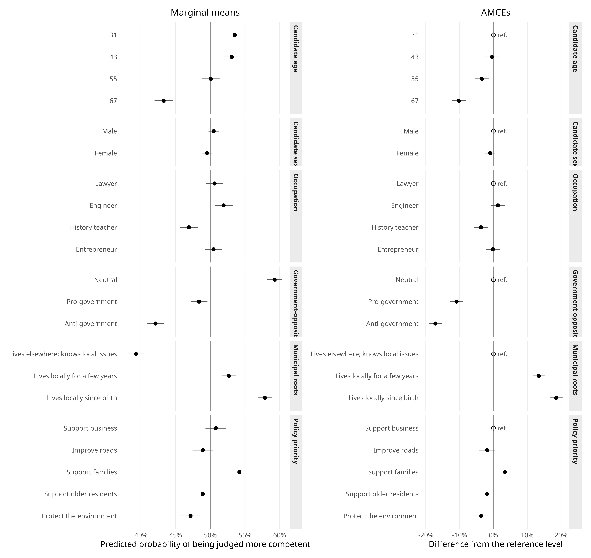
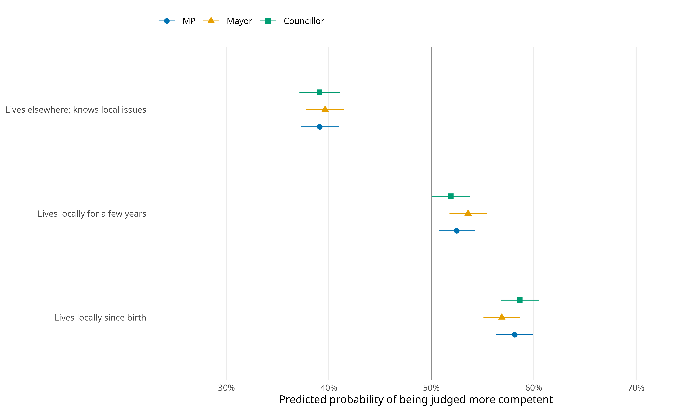
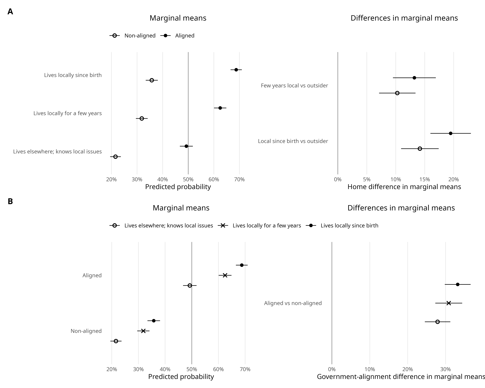

# Introduction

Friends-and-neighbors voting (FNV) is a recurring pattern in electoral geography: candidates tend to receive disproportionate support where they live, were born, or otherwise have a local connection [@key1949; @lewisbeck1983; @gimpel2008]. Evidence from election returns links geographic proximity and candidate localness to vote choice across national contests [@gorecki2012; @evans2017] and in Polish rural mayoral elections, where candidates also gain support in and near their home localities [@gorecki2022]. Those observational associations, however, combine several mechanisms. Local information about candidates declines with distance [@bowler1993], while locally rooted candidates may canvass more intensively near home, draw on personal networks, enjoy greater name recognition, or mobilize nearby voters more effectively.

This distinction separates *descriptive localism* from two possible interpretations of it. Descriptive localism is the observable fact that a candidate lives locally. Voters may translate that fact into *behavioral localism*---an expectation that the candidate will know, represent, or serve the area better---or into *symbolic localism*, an attachment to someone perceived as belonging to the same local community. Survey experiments show that residence affects candidate evaluations even when profiles provide comparable information [@campbellcowley2014]. Later studies do not support a single universal mechanism. @campbell2019 find that expected local service explains part of the local-candidate advantage, while @nyholt2024 finds that residence preferences are not reducible to symbolic local attachment. The present experiment tests the exact municipal-connection statements shown to respondents; it does not manipulate campaign effort or directly observe personal acquaintance.

Candidate conjoint experiments are well suited to this narrower task because they randomize several candidate signals within a common choice environment [@hainmueller2014; @schwarz2022]. Existing applications show that local ties matter in candidate selection among party elites [@berz2022]. Most directly for voters, @munis2021 finds that candidate roots remain relevant alongside party labels in a polarized US congressional setting. The present design extends this comparison by holding the profile attributes constant across three offices and by defining government--opposition alignment relative to each respondent rather than treating the national cue only as a profile attribute.

We do so with a candidate conjoint embedded in the 2024 Polish Local Election Study (PLES) [@DVN_LKY4WZ_2025]. Respondents were randomly assigned to evaluate candidates for one of three offices: member of parliament (MP), municipal councillor, or mayor. Every group received the same randomized candidate attributes, including municipal residence and attitude toward the current national government. The latter is not a literal party label. It is a government--opposition cue that approximates a central partisan division in a context of sustained top-down polarization [@tworzecki2019].

The main finding is that these cues operate differently. Municipal roots increase comparative competence judgments across offices and among respondents with clear pro- or anti-government attitudes. Depending on the municipal-connection statement, aligned profiles are 27.9--33.2 percentage points more likely to be judged more competent than non-aligned profiles. By comparison, the municipal-roots contrast within a fixed alignment group ranges from 10.3 to 19.5 points. The residence gradient is therefore positive, but its point estimates are smaller than the government--opposition alignment contrasts in this subsample. Office-specific residence estimates are positive but do not follow a clear hierarchy.

The paper makes three contributions. First, it experimentally identifies contrasts among the municipal-connection statements while profiles contain no information about campaign activity. Second, it compares those contrasts with a government--opposition cue. Third, its split-ballot design holds the profile information constant while changing the office under consideration. The design cannot establish why voters value local candidates or separate residence from every feature of the statement wording, but it shows how the randomized municipal-connection profiles affect comparative competence judgments.

# Locality, Government--Opposition Alignment, and Office Type

## Residence as an informational signal

Voters often make decisions with limited information and use observable candidate traits as shortcuts [@popkin1991; @lupia1994]. Municipal residence may signal knowledge of local problems, shared material interests, accessibility after the election, reputational accountability, or embeddedness in local networks. These inferences need not be correct for the cue to affect choice. Nor do they require the respondent to know the candidate personally.

Different forms of local connection need not carry the same information. In Estonia, local political experience predicts electoral success and parliamentary independence, whereas local birthplace does not [@tavits2010]. A separate identity-based account treats support for a hometown candidate as an expression of local group membership; evidence from German elections is consistent with this interpretation even for candidates with little prospect of winning office [@schultecloos2023]. These findings make behavioral and symbolic interpretations plausible, but neither establishes what respondents infer from the residence wording used here.

The conceptual distinction is important for interpreting the experiment. The municipal-connection attribute operationalizes descriptive localism: profiles state that the candidate has lived in the municipality since birth, has lived there for a few years, or lives elsewhere while claiming to know local problems. A positive contrast between these complete statements is consistent with voters inferring behavioral or symbolic proximity, but it does not identify either mechanism. It also differs from the campaign-contact process documented in observational research [@gorecki2012]. We therefore expect the locally resident statements to produce more favorable evaluations than the outsider statement, while treating the mechanism as unresolved.

## Government--opposition alignment

Local cues compete with national political information. Poland's party competition has been structured by a durable and increasingly affective government--opposition divide [@tworzecki2019]. US conjoint evidence nevertheless shows that candidate roots can remain relevant alongside party labels under polarization and nationalization [@munis2021]. The two cues are therefore not mutually exclusive. In the Polish profiles, a candidate's attitude toward the current government can signal ideological or partisan compatibility even though no party name appears. The cue should be evaluated relative to the respondent's own attitude rather than only through its pooled average.

The primary comparison is deliberately restricted to clear profile--respondent relations. A profile is *aligned* when both the candidate and respondent are pro-government or both are anti-government. It is *non-aligned* when one is pro-government and the other anti-government. Neutral candidate profiles and respondents in the middle of the attitude scale are excluded from this contrast rather than assigned to a heterogeneous residual category. This restriction does not imply that neutral or middle positions are unimportant; it defines a direct congruence comparison. We expect aligned profiles to outperform non-aligned profiles. Whether that alignment contrast exceeds the municipal-roots contrast is an empirical question central to the paper.

## Office-level expectations

The informational value of municipal roots may vary with office. Electoral-system research treats local ties as personal vote-earning attributes whose usefulness depends on how voters choose among individual candidates [@shugart2005; @jankowski2016]. The councillor prompt supplies the most territorially focused representative role, the mayor prompt concerns municipality-wide executive office, and the MP prompt provides a less municipally focused comparison. This ordering suggests that municipal roots could matter most for councillors, less for mayors, and least for MPs. The expectation remains tentative because the same municipal-connection wording may carry meaning even for national office, and the split-ballot sample limits precision. We therefore evaluate the full interaction and its omnibus test rather than treating the rank order of point estimates as decisive evidence.

# Research Design

## Survey and sample

The conjoint was fielded in wave 1 of PLES, a CAWI survey conducted through the Ariadna online panel from 28 March to 7 April 2024 [@DVN_LKY4WZ_2025]. The technical report records 9,534 invitations, 2,935 respondents entering the survey, 521 incomplete interviews, 207 quality-control exclusions, and 2,207 completed interviews, for a reported response rate of 23.1%. The random-quota sample used municipality size, sex, age, education, and voivodeship. The [sampling appendix](#sec-sampling) provides further sampling and weighting information.

Respondents were randomly assigned to an MP ($n=778$), councillor ($n=687$), or mayor ($n=742$) prompt. They then completed four paired-profile tasks. The attributes, levels, and outcomes were identical across conditions; only the office named in the instruction differed. The design produced 8,828 paired choices and 17,656 evaluated profiles.

## Attributes and outcomes

@tbl-attributes gives English translations of the attributes and levels recorded in the technical report. Sex and occupation appeared in gender-consistent forms in Polish. The government item described a candidate as a supporter of, neutral toward, or opponent of the current government. The municipal-roots attribute randomized three complete statements: residence since birth, residence for a few years, and residence elsewhere with declared knowledge of local problems. The outsider's knowledge declaration makes it an informative reference level, but it also means that the estimates compare bundled statements rather than residence separated factorially from every other phrase.

| Attribute | Levels |
|---|---|
| Candidate sex | Woman; man |
| Occupation | Lawyer; engineer; history teacher; entrepreneur |
| Age | 31; 43; 55; 67 |
| Attitude toward current government | Supporter; neutral; opponent |
| Connection with municipality | Lives in the municipality since birth; lives in the municipality for a few years; lives in another municipality but declares knowledge of the area's problems |
| Important issue | More support for families; more support for older residents; more support for entrepreneurs; more concern for the environment and climate; more concern for road quality |

: Candidate attributes and randomized levels {#tbl-attributes}

*Note.* Translated from the Polish technical report. The same profile attributes were used in all office conditions. Age and sex were presented jointly with gendered occupational labels.

The technical report describes selection of the preferred profile, whereas the released profile-level outcome is labelled “Candidate is more competent for the office (outcome variable).” The report does not reproduce the verbatim response screen. We therefore follow the released outcome label and interpret the binary variable `competence` as selection of the profile judged more competent; one profile in each pair takes the value one. Respondents also rated the selected profile's advantage on an 11-point scale. The robustness analysis assigns that value positively to the selected profile and negatively to the other profile, producing a profile-level range from $-10$ to $10$. These outcomes capture stated comparative evaluation, not actual turnout or vote choice.

## Estimands and model specification

The main estimates come from unweighted linear probability models with standard errors clustered by respondent. The models include indicators for every randomized attribute level and the office condition. Random assignment identifies average marginal component effects (AMCEs) relative to the stated reference levels [@hainmueller2014]. Because profile distributions can affect both interpretation and external validity, the estimates apply to the randomized distribution used here rather than to every possible real-world candidate pool [@delacuesta2022].

@fig-main-effects reports both marginal means (MMs) and AMCEs. An MM is the average predicted probability of being judged more competent at an attribute level, averaging over the design distribution of the other attributes. An AMCE is the average change relative to a named reference level. MMs make levels directly comparable without making a subgroup's result depend on an arbitrary reference category. Accordingly, the office and alignment analyses use MMs and differences in MMs, following the recommendation for subgroup comparisons in @leeper2020. We use response-scale differences from interaction models rather than interpreting raw product-term coefficients. This choice is also consistent with the broader distinction between factorial interaction parameters and substantively interpretable conditional contrasts [@egami2019].

The respondent alignment measure uses the 0--10 question about the government of Donald Tusk and the governing coalition. In the primary coding, scores 0--3 are anti-government and scores 7--10 are pro-government. The alignment analysis further excludes neutral candidate profiles, leaving 1,635 respondents and 8,712 profiles in the clear aligned--non-aligned comparison. The model controls for the respondent's pro- or anti-government group. The [model-specification appendix](#sec-models) gives the equations, the [alignment-sensitivity appendix](#sec-alignment-sensitivity) varies the attitude cutoffs, and the [robustness appendix](#sec-robustness) compares the unweighted results with two post-stratification weights and the advantage-scale outcome.

# Results

## Average candidate evaluations

@fig-main-effects presents pooled MMs and AMCEs. The vertical reference line in the MM panel is 0.50, the average implied by paired forced choice. In the AMCE panel it is zero; open reference markers identify the omitted levels and should not be read as estimated zero effects.

Municipal roots are among the strongest positive profile cues. Relative to a candidate who lives elsewhere but claims to know local issues, the statement that the candidate has lived in the municipality for a few years increases the probability of being judged more competent by 13.4 percentage points (95% CI: 11.6 to 15.2). The statement that the candidate has lived there since birth increases it by 18.6 points (95% CI: 16.7 to 20.4). The corresponding MMs are 39.3% for the outsider, 52.7% for a resident of a few years, and 57.9% for a lifelong resident.

The pooled government contrasts are also large, but neutrality has the highest average MM. Relative to a neutral profile, a pro-government profile is 10.9 points less likely to be judged more competent (95% CI: 9.0 to 12.9 points), and an anti-government profile is 17.2 points less likely (95% CI: 15.3 to 19.1 points). These pooled penalties combine respondents who agree, disagree, or occupy a middle position. @sec-main-finding restricts the analysis to clearly aligned and non-aligned relations and provides the central comparison with local roots.

{#fig-main-effects fig-alt="Two-panel coefficient plot showing marginal means and average marginal component effects for all candidate attributes."}

*Note.* Unweighted linear probability model with respondent-clustered standard errors and 95% confidence intervals. The outcome equals one when the profile was selected as more competent. The MM panel averages predictions over the randomized distribution of other attributes; its vertical line marks 0.50. AMCEs are contrasts against the open reference markers; their vertical line marks zero. Estimates are expressed as proportions.

## Municipal roots across offices

Office-specific MMs for municipal roots appear in @fig-office. The residence gradient is present in every condition. Relative to the outsider profile, living locally for a few years raises the probability of being judged more competent by 13.4 points for MP profiles (95% CI: 10.3 to 16.5), 14.0 points for mayoral profiles (95% CI: 10.8 to 17.1), and 12.8 points for councillor profiles (95% CI: 9.6 to 16.1). The lifelong-resident contrasts are 19.0 points for MPs (95% CI: 15.9 to 22.2), 17.2 points for mayors (95% CI: 14.1 to 20.4), and 19.5 points for councillors (95% CI: 16.2 to 22.9).

The point estimates do not display the predicted monotonic office ordering. More importantly, an omnibus Wald test does not detect heterogeneity in the municipal-roots terms across offices, $F(4,2185)=0.661$, $p=.619$. This is evidence of imprecision about office differences, not proof that the effects are equal. The data therefore do not support the claim that the municipal-roots contrast is strongest for councillor profiles.

{#fig-office width=86% fig-alt="Point estimates and confidence intervals for the three municipal-roots levels, shown separately for MP, mayor, and councillor profiles."}

*Note.* MMs from an unweighted linear probability model interacting municipal roots with office; 95% respondent-clustered confidence intervals. The vertical line marks 0.50. Numerical comparisons in the text are differences in MMs within office.

## Government alignment and municipal roots: the main comparison {#sec-main-finding}

@fig-heterogeneity presents the paper's main comparison among clearly positioned profiles and respondents. Its left column shows MMs; its right column shows differences in MMs with a zero reference line. Panel A asks how the municipal-roots contrast changes between aligned and non-aligned profile--respondent relations. Panel B reverses the comparison and asks how government--opposition alignment changes within each municipal-connection level.

The municipal-roots contrast is positive in both alignment groups. Compared with the outsider statement, residence for a few years gains 10.3 points among non-aligned pairs (95% CI: 7.1 to 13.4) and 13.2 points among aligned pairs (95% CI: 9.5 to 16.9). The lifelong-resident contrasts are 14.2 points among non-aligned pairs (95% CI: 10.9 to 17.4) and 19.5 points among aligned pairs (95% CI: 16.0 to 23.0). Political agreement is therefore not required for the positive residence gradient.

The reverse contrast has larger point estimates. Relative to non-aligned profiles, aligned profiles gain 27.9 points among outsiders (95% CI: 24.5 to 31.3), 30.8 points among residents of a few years (95% CI: 27.3 to 34.4), and 33.2 points among lifelong residents (95% CI: 29.8 to 36.6). Across all three municipal-connection levels, the aligned--non-aligned estimate exceeds the corresponding residence estimate. The [alignment-sensitivity appendix](#sec-alignment-sensitivity) shows the same ordering under narrower and broader respondent-attitude cutoffs, although the exact alignment estimates range from 25.9 to 33.5 points.

This does not mean that the experiment estimates a generic “party effect.” Candidate profiles contain no party label, and the respondent measure concerns attitude toward the current government. The result is specifically about congruence on a government--opposition cue among clearly pro- and anti-government cases. It shows that this national cue structures candidate evaluation even when the office prompt is local and municipal roots are visible; it does not estimate polarization as a respondent trait or social process.

{#fig-heterogeneity fig-alt="Four-panel plot comparing municipal-roots marginal means by political alignment and political-alignment contrasts within each municipal-roots level."}

*Note.* MMs and differences in MMs from an unweighted linear probability model with municipal-roots-by-alignment interactions, a respondent attitude-group control, and respondent-clustered 95% confidence intervals ($1{,}635$ respondents; $8{,}712$ profiles). Aligned means pro/pro or anti/anti candidate--respondent combinations. Non-aligned means pro/anti or anti/pro combinations. Neutral candidate profiles and respondents scoring 4--6 are outside this comparison. MM panels use a 0.50 reference line; difference panels use zero.

# Discussion

The experiment estimates a sizeable contrast between the exact municipal-connection statements. Profiles described as living in the municipality are more likely to be judged competent than profiles described as living elsewhere while declaring knowledge of local problems, with occupation, age, sex, policy priority, government attitude, and office included in the randomized design. Because the outsider statement uniquely includes the knowledge declaration, the design does not separate a pure residence effect from all other wording differences. The causal estimand is the effect of assigning the complete profile statement.

This result complements rather than replaces observational evidence from Polish mayoral elections. That research documents localized vote and turnout advantages [@gorecki2022], quantities that can reflect residence, information diffusion, campaign contact, and mobilization together. The conjoint instead shows that the stated municipal connection changes comparative competence judgments when other profile information is randomized.

The result does not identify the psychological mechanism. Respondents may infer local knowledge, shared interests, accessibility, accountability, or community membership. Prior work distinguishes behavioral and symbolic accounts [@campbell2019; @nyholt2024; @schultecloos2023], but the present design does not manipulate these mediators. It also cannot estimate canvassing, home-area mobilization, personal acquaintance, or network effects. Those processes remain central to explaining observational FNV patterns [@bowler1993; @gorecki2012; @evans2017]; they are simply outside this experiment.

The contrast with national politics is equally important. Pooled results make neutral candidates appear most attractive, but that average combines agreement, disagreement, and middle positions. Among clearly pro- and anti-government cases, congruence produces differences of roughly 28--33 points, while municipal-roots contrasts are roughly 10--20 points. The persistence of the residence gradient parallels US evidence that roots remain relevant alongside partisanship [@munis2021]; here, the government-alignment point estimates are larger. Neutral candidates and respondents with middle-scale attitudes remain substantively important, but they are not part of this binary comparison.

The office comparison is more cautious. Municipal roots matter descriptively for MP, mayoral, and councillor profiles, but the interaction test does not detect cross-office heterogeneity and the point estimates do not follow the expected councillor--mayor--MP ordering. This may reflect a broadly understood candidate-quality cue, limited precision, or the unusual act of evaluating an MP through municipal residence. Replication with treatments tailored to each office's territorial scale would help distinguish these explanations.

Four further limits qualify the conclusions. First, the released materials do not include the verbatim outcome screen: the technical report refers to a preferred profile, whereas the data label refers to the candidate judged more competent. The analysis follows the data label, but the distinction should be resolved against the original questionnaire before journal submission. Second, the conjoint measures stated profile evaluations, not actual electoral behavior. Paired conjoint designs have recovered relative attribute effects in a close behavioral benchmark [@hainmueller2015], but that validation does not establish that the present estimates equal effects in Polish elections. Third, the online quota sample is not a simple probability sample; weighting checks are similar but cannot eliminate all selection concerns. Fourth, the AMCEs and MMs average over the experiment's profile distribution, so changing the prevalence or combination of candidate traits could change the quantities of interest [@delacuesta2022]. These limits constrain interpretation and external validity while leaving the randomized contrasts among the presented profile statements intact.

# Conclusion

The randomized municipal-connection statements change how Polish respondents evaluate candidate competence. Compared with an outsider who declares local knowledge, lifelong municipal residence produces an average 18.6-point advantage and residence for a few years produces a 13.4-point advantage. The gradient is positive in all three office prompts, although the omnibus test does not detect office heterogeneity. Among clearly pro- and anti-government profiles and respondents, aligned profiles outperform non-aligned profiles by 27.9--33.2 points, larger point estimates than the 10.3--19.5-point residence contrasts within those groups. The findings qualify two simple interpretations of FNV. A stated local connection can generate an advantage when profiles provide no campaign information, but the bundled wording prevents isolation of residence alone and the experiment does not show that campaign or network processes are absent from actual elections. Local candidate evaluation is also not insulated from national politics, because government--opposition congruence supplies a larger conditional cue in the analyzed subsample.

# Data availability {.unnumbered}

The accompanying `reproduction/` directory contains the redistributable source datasets, R analysis code, `targets` workflow, and generated numerical results. Its pipeline regenerates the figures used by this Quarto manuscript.

# Funding {.unnumbered}

The survey was conducted as part of the project “Political Representation of Women in Local Governments,” funded by the National Science Centre, Poland (grant 2021/43/B/HS5/01059).

# Appendix {.unnumbered}

## Sampling, fieldwork, and weights {.unnumbered #sec-sampling}

Wave 1 was fielded online between 28 March and 7 April 2024. Ariadna invited 9,534 panel members; 2,935 entered the survey, 521 did not complete it, and 207 were removed by quality-control criteria, leaving 2,207 respondents. Quotas covered sex, five age categories, five municipality-size categories, two education categories, and 16 voivodeships. The split-ballot assignment yielded 778 MP, 742 mayor, and 687 councillor respondents.

The released data contain two post-stratification weights. The census-margin post-stratification weight adjusts the quota dimensions to 2021 census margins and ranges from 0.536 to 1.760 in wave 1. The census and reported 2023-vote post-stratification weight additionally adjusts reported turnout and party vote in the 2023 parliamentary election and ranges from 0.229 to 3.004. The unweighted model is primary because the experimental attributes are randomized. @tbl-robustness shows that both weighted specifications yield the same substantive municipal-roots and government-cue pattern.

## Task wording and coding {.unnumbered #sec-wording}

The technical report states that respondents saw two randomized profiles for the assigned office, selected one profile, and then indicated the size of its advantage on an 11-point scale. It does not reproduce a verbatim screen export. @tbl-attributes therefore reports direct English translations of the attribute labels and levels, while the main-outcome wording is taken from the released data label: “Candidate is more competent for the office (outcome variable).” The respondent moderator is translated from: “What is your attitude toward the government of Donald Tusk and the coalition currently governing Poland?” Its scale runs from 0 (opponent) to 10 (supporter).

The alignment coding is:

- aligned: pro-government candidate with a respondent scoring 7--10, or anti-government candidate with a respondent scoring 0--3;
- non-aligned: pro-government candidate with a respondent scoring 0--3, or anti-government candidate with a respondent scoring 7--10.

Neutral candidate profiles and respondents scoring 4--6 are excluded from the primary alignment comparison. Alternative respondent cutoffs are reported in the [alignment-sensitivity appendix](#sec-alignment-sensitivity).

## Model specifications {.unnumbered #sec-models}

For profile $j$ in task $t$ evaluated by respondent $i$, the pooled model underlying @fig-main-effects is

$$
Y_{ijt}=\alpha+\sum_{a}\sum_{l\neq 0}\beta_{al}D_{ijtal}+\boldsymbol{\delta}^{\mathsf T}\mathbf{O}_{i}+\varepsilon_{ijt},
$$

where $D_{ijtal}$ indexes non-reference level $l$ of randomized attribute $a$, and $\mathbf{O}_{i}$ contains office-condition indicators. Standard errors are clustered by respondent. @fig-office replaces the additive municipal-roots and office terms with their full interaction:

$$
Y_{ijt}=\alpha+\boldsymbol{\beta}^{\mathsf T}\mathbf{X}_{ijt}+\boldsymbol{\gamma}^{\mathsf T}(\mathbf{M}_{ijt}\times\mathbf{O}_{i})+\varepsilon_{ijt}.
$$

@fig-heterogeneity analogously interacts municipal roots $\mathbf{M}_{ijt}$ with the binary alignment measure $\mathbf{A}_{ijt}$ and controls for the respondent's pro- or anti-government attitude group $\mathbf{R}_{i}$:

$$
Y_{ijt}=\alpha+\boldsymbol{\beta}^{\mathsf T}\mathbf{X}_{ijt}+\boldsymbol{\theta}^{\mathsf T}(\mathbf{M}_{ijt}\times\mathbf{A}_{ijt})+\boldsymbol{\rho}^{\mathsf T}\mathbf{R}_{i}+\boldsymbol{\delta}^{\mathsf T}\mathbf{O}_{i}+\varepsilon_{ijt}.
$$

In the second and third equations, $\mathbf{X}_{ijt}$ contains the remaining randomized attributes. In the alignment model, the randomized government cue enters through $\mathbf{A}_{ijt}$ rather than as a separate additive term. Reported conditional results are predictions averaged over the analyzed profile distribution and their linear contrasts, not the raw interaction coefficients.

## Alignment-coding sensitivity {.unnumbered #sec-alignment-sensitivity}

The primary 0--3 and 7--10 respondent cutoffs are operational choices rather than natural breaks in the scale. @tbl-alignment-sensitivity repeats the aligned--non-aligned contrasts using narrower (0--2 versus 8--10) and broader (0--4 versus 6--10) definitions. The estimates remain positive at every municipal-connection level and retain the same ordering relative to the residence contrasts. Their exact magnitude declines as the respondent groups broaden.

| Coding | Municipal-roots level | Respondents | Profiles | Aligned minus non-aligned | 95% CI |
|:---|:---|---:|---:|---:|:---|
| Narrow: 0-2 vs 8-10 | Lives elsewhere; knows local issues | 1381 | 7366 | 0.300 | 0.263, 0.337 |
| Narrow: 0-2 vs 8-10 | Lives locally for a few years | 1381 | 7366 | 0.324 | 0.286, 0.363 |
| Narrow: 0-2 vs 8-10 | Lives locally since birth | 1381 | 7366 | 0.335 | 0.298, 0.372 |
| Primary: 0-3 vs 7-10 | Lives elsewhere; knows local issues | 1635 | 8712 | 0.279 | 0.245, 0.313 |
| Primary: 0-3 vs 7-10 | Lives locally for a few years | 1635 | 8712 | 0.308 | 0.273, 0.344 |
| Primary: 0-3 vs 7-10 | Lives locally since birth | 1635 | 8712 | 0.332 | 0.298, 0.366 |
| Broad: 0-4 vs 6-10 | Lives elsewhere; knows local issues | 1841 | 9776 | 0.259 | 0.227, 0.291 |
| Broad: 0-4 vs 6-10 | Lives locally for a few years | 1841 | 9776 | 0.299 | 0.265, 0.333 |
| Broad: 0-4 vs 6-10 | Lives locally since birth | 1841 | 9776 | 0.307 | 0.274, 0.340 |

: Sensitivity of aligned--non-aligned contrasts to respondent-attitude cutoffs {#tbl-alignment-sensitivity}

*Note.* Entries are differences in marginal means from the alignment model, with respondent-clustered 95% confidence intervals. Respondents between the indicated endpoint groups and neutral candidate profiles are excluded. The respondent and profile counts are constant across the three municipal-connection rows within each coding.

## Randomization balance {.unnumbered #sec-balance}

@tbl-balance reports the observed frequency of every randomized level within each office condition. The maximum minus minimum office share is at most 0.019 across all levels, consistent with the intended common randomization scheme.

| Attribute | Level | MP | Mayor | Councillor | Max-min |
|:---|:---|---:|---:|---:|---:|
| Candidate age | 31 | 0.248 | 0.247 | 0.251 | 0.004 |
| Candidate age | 43 | 0.259 | 0.257 | 0.248 | 0.011 |
| Candidate age | 55 | 0.244 | 0.256 | 0.246 | 0.012 |
| Candidate age | 67 | 0.249 | 0.241 | 0.255 | 0.015 |
| Candidate sex | Male | 0.506 | 0.489 | 0.508 | 0.019 |
| Candidate sex | Female | 0.494 | 0.511 | 0.492 | 0.019 |
| Occupation | Lawyer | 0.258 | 0.252 | 0.252 | 0.006 |
| Occupation | Engineer | 0.252 | 0.241 | 0.252 | 0.011 |
| Occupation | History teacher | 0.246 | 0.244 | 0.237 | 0.009 |
| Occupation | Entrepreneur | 0.245 | 0.264 | 0.259 | 0.019 |
| Government-opposition cue | Neutral | 0.334 | 0.342 | 0.334 | 0.008 |
| Government-opposition cue | Pro-government | 0.341 | 0.333 | 0.340 | 0.008 |
| Government-opposition cue | Anti-government | 0.325 | 0.325 | 0.326 | 0.001 |
| Municipal roots | Lives elsewhere; knows local issues | 0.328 | 0.337 | 0.328 | 0.009 |
| Municipal roots | Lives locally for a few years | 0.335 | 0.328 | 0.331 | 0.007 |
| Municipal roots | Lives locally since birth | 0.337 | 0.335 | 0.341 | 0.006 |
| Policy priority | Support business | 0.195 | 0.201 | 0.205 | 0.009 |
| Policy priority | Improve roads | 0.197 | 0.199 | 0.201 | 0.004 |
| Policy priority | Support families | 0.210 | 0.203 | 0.194 | 0.016 |
| Policy priority | Support older residents | 0.199 | 0.196 | 0.199 | 0.003 |
| Policy priority | Protect the environment | 0.200 | 0.201 | 0.202 | 0.003 |

: Randomized attribute-level shares by office condition {#tbl-balance}

## Tabular model estimates {.unnumbered #sec-estimates}

@tbl-model-estimates reports the coefficients from the unweighted pooled linear probability model used for the AMCE panel in @fig-main-effects. Office coefficients are close to zero by construction because exactly one profile is selected in each pair and office is assigned at respondent level; the office-specific quantities of interest in @fig-office come from interactions with municipal roots.

| Term | Estimate | Std. error | 95% CI |
|:---|---:|---:|:---|
| Intercept | 0.539 | 0.015 | 0.510, 0.568 |
| Age: 43 vs 31 | -0.004 | 0.011 | -0.025, 0.016 |
| Age: 55 vs 31 | -0.035 | 0.011 | -0.055, -0.014 |
| Age: 67 vs 31 | -0.103 | 0.011 | -0.124, -0.081 |
| Female vs male | -0.010 | 0.007 | -0.024, 0.005 |
| Engineer vs lawyer | 0.013 | 0.011 | -0.008, 0.034 |
| History teacher vs lawyer | -0.037 | 0.011 | -0.058, -0.016 |
| Entrepreneur vs lawyer | -0.002 | 0.010 | -0.022, 0.019 |
| Pro-government vs neutral | -0.109 | 0.010 | -0.129, -0.090 |
| Anti-government vs neutral | -0.172 | 0.010 | -0.191, -0.153 |
| Few years local vs outsider | 0.134 | 0.009 | 0.116, 0.152 |
| Local since birth vs outsider | 0.186 | 0.009 | 0.167, 0.204 |
| Improve roads vs support business | -0.019 | 0.012 | -0.042, 0.004 |
| Support families vs support business | 0.034 | 0.012 | 0.010, 0.058 |
| Support older residents vs support business | -0.019 | 0.012 | -0.043, 0.004 |
| Environment vs support business | -0.037 | 0.012 | -0.060, -0.013 |
| Mayor vs MP prompt | 0.000 | 0.002 | -0.004, 0.005 |
| Councillor vs MP prompt | 0.001 | 0.002 | -0.003, 0.005 |

: Pooled unweighted linear probability model {#tbl-model-estimates}

## Weighting and alternative-outcome robustness {.unnumbered #sec-robustness}

@tbl-robustness compares the four focal AMCEs across the unweighted model, the census-margin post-stratified model, and the census plus reported 2023-vote post-stratified model. It also reports the unweighted signed-advantage model. Weighting changes some pooled government coefficients because those cues interact with respondent orientations, but it does not change the direction or substantive conclusion. Municipal-roots estimates remain positive under every specification.

For the alternative outcome, respondents rated the selected profile's advantage from 0 to 10. Across the 8,828 tasks, all scale points occur in the data. The selected profile retains the non-negative value and the unselected profile receives its negative, producing a symmetric profile-level scale from $-10$ to $10$. On this scale, living locally for a few years increases the advantage by 1.79 points and lifelong residence by 2.48 points; pro-government and anti-government cues reduce it by 1.43 and 2.28 points, respectively, relative to neutrality.

| Outcome | Weight | Attribute | Contrast | Estimate | 95% CI |
|:---|:---|:---|:---|---:|:---|
| Signed advantage | None | Government-opposition cue | Anti-government vs neutral | -2.279 | -2.538, -2.020 |
| Signed advantage | None | Government-opposition cue | Pro-government vs neutral | -1.431 | -1.699, -1.163 |
| Signed advantage | None | Municipal roots | Few years local vs outsider | 1.786 | 1.542, 2.030 |
| Signed advantage | None | Municipal roots | Local since birth vs outsider | 2.480 | 2.231, 2.729 |
| Binary competence | None | Government-opposition cue | Anti-government vs neutral | -0.172 | -0.191, -0.153 |
| Binary competence | None | Government-opposition cue | Pro-government vs neutral | -0.109 | -0.129, -0.090 |
| Binary competence | None | Municipal roots | Few years local vs outsider | 0.134 | 0.116, 0.152 |
| Binary competence | None | Municipal roots | Local since birth vs outsider | 0.186 | 0.167, 0.204 |
| Binary competence | Census-margin post-stratification | Government-opposition cue | Anti-government vs neutral | -0.173 | -0.193, -0.154 |
| Binary competence | Census-margin post-stratification | Government-opposition cue | Pro-government vs neutral | -0.114 | -0.134, -0.094 |
| Binary competence | Census-margin post-stratification | Municipal roots | Few years local vs outsider | 0.127 | 0.108, 0.146 |
| Binary competence | Census-margin post-stratification | Municipal roots | Local since birth vs outsider | 0.184 | 0.165, 0.203 |
| Binary competence | Census + reported 2023-vote post-stratification | Government-opposition cue | Anti-government vs neutral | -0.149 | -0.170, -0.129 |
| Binary competence | Census + reported 2023-vote post-stratification | Government-opposition cue | Pro-government vs neutral | -0.143 | -0.165, -0.121 |
| Binary competence | Census + reported 2023-vote post-stratification | Municipal roots | Few years local vs outsider | 0.118 | 0.098, 0.139 |
| Binary competence | Census + reported 2023-vote post-stratification | Municipal roots | Local since birth vs outsider | 0.178 | 0.158, 0.199 |

: Robustness of focal cue estimates {#tbl-robustness}

*Note.* Competence coefficients are probability differences; advantage coefficients are points on the signed $-10$ to $10$ profile scale. All models use respondent-clustered standard errors and include all randomized profile attributes plus office indicators.

| Advantage rating | Number of tasks | Percent |
|---:|---:|---:|
| 0 | 201 | 2.3 |
| 1 | 222 | 2.5 |
| 2 | 316 | 3.6 |
| 3 | 357 | 4.0 |
| 4 | 400 | 4.5 |
| 5 | 1503 | 17.0 |
| 6 | 1542 | 17.5 |
| 7 | 1750 | 19.8 |
| 8 | 1314 | 14.9 |
| 9 | 571 | 6.5 |
| 10 | 652 | 7.4 |

: Distribution of the selected profile's advantage rating {#tbl-advantage-distribution}

# References {.unnumbered}
