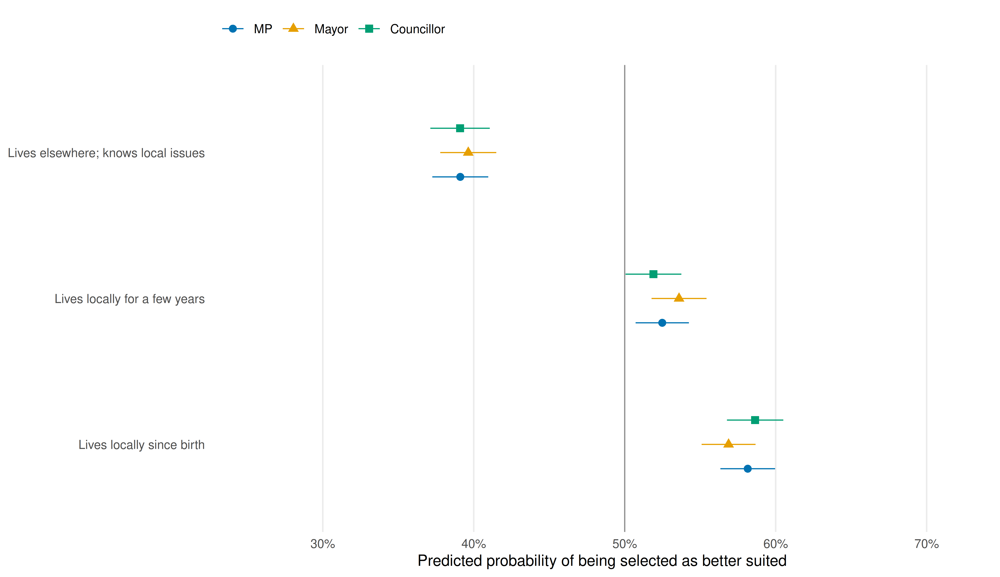
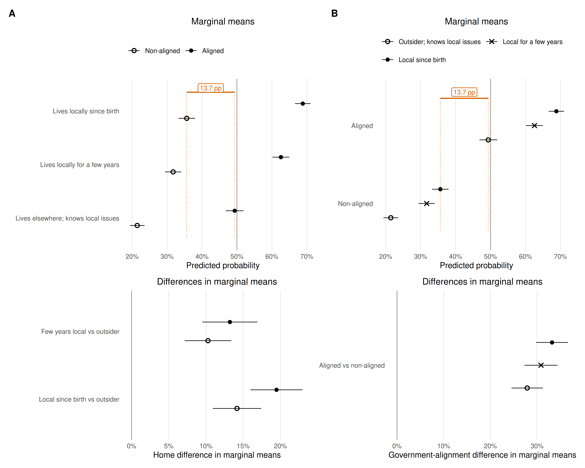

# Introduction

{++Local roots need not insulate candidate evaluation from national politics. In polarized systems, voters may reward municipal embeddedness while still ranking candidates through the national political divide. The central question is therefore not simply whether candidates benefit near home, but how local roots operate when national political alignment is visible.++} Friends-and-neighbors voting (FNV) is a recurring pattern in electoral geography: candidates{-- tend to--} receive disproportionate support where they live, were born, or otherwise have a local connection [@key1949; @lewisbeck1983;{++ @rice1987;++} @gimpel2008]. {--Evidence from election returns links geographic proximity--}{++At the national level, candidate--voter distance and candidate localness predict++} vote choice {--across--}{++in++} national {--contests--}{++elections++} [{++@arzheimer2012; ++}@gorecki2012; @evans2017; @hunt2022]{++, intraparty competition [@put2020], and evaluations of party leaders [@put2021]. At the subnational level, local advantages appear in a Polish open-list council election and Polish rural mayoral elections [@czapiewski2021; @gorecki2022], German local executive elections [@zissel2026], and US state-legislative contests [@huntrouse2023].++} {--Those--}{++These++} observational {--associations, however,--}{++associations++} combine several {--mechanisms.--}{++processes.++} Local information{-- about candidates--} declines with distance [@bowler1993], while locally rooted candidates may canvass {--more intensively near home,--}{++more,++} draw on personal networks, enjoy greater name recognition, or mobilize nearby {--voters more effectively.--}{++voters. Field experiments confirm that appeals to shared geography can increase turnout [@panagopoulos2017; @panagopoulosbailey2020], but they do not show where place-based evaluation sits relative to a national political cue.++}

{--This distinction separates *descriptive localism* from two possible interpretations of it. Descriptive localism is the observable fact that a candidate lives locally. Voters may translate that fact into *behavioral localism*---an expectation that the candidate will know, represent, or serve the area better---or into *symbolic localism*, an attachment to someone perceived as belonging to the same local community. --}Survey and ballot-information experiments show that residence affects candidate evaluations{-- even--} when profiles provide comparable information [@campbellcowley2014; @harfst2023].{-- Later studies do not support a single universal mechanism. @campbell2019 find that expected local service explains part of the local-candidate advantage, while @nyholt2024 finds that residence preferences are not reducible to symbolic local attachment. The present experiment tests the exact municipal-connection statements shown to respondents; it does not manipulate campaign effort or directly observe personal acquaintance.--}{++ Recent work has examined expectations of local service, place identity, community embeddedness, and localistic appeals [@campbell2019; @schultecloos2023; @velimsky2024; @munisburke2023; @nyholt2024; @ornstein2025]. These studies do not support one universal mechanism, and several caution that residence duration bundles multiple possible inferences. Localism is graded, yet research often reduces it to a local--non-local distinction, and usually studies that distinction apart from national political congruence. Parties also field recognizable “parachute” candidates with no prior connection to a constituency [@arterpoyet2024]. We compare three complete municipal-connection statements---lifelong residence, residence for a few years, and residence elsewhere with declared local knowledge---and locate their effects within the national government--opposition divide.++}

Candidate conjoint experiments {--are well suited to this narrower task because they randomize--}{++can compare++} several candidate signals within a common choice environment [@hainmueller2014; @schwarz2022]. Existing applications show that local ties matter in candidate selection among party elites [@berz2022]{++ and alongside party labels among voters in a polarized US setting [@munis2021]++}.{-- Most directly for voters, @munis2021 finds that candidate roots remain relevant alongside party labels in a polarized US congressional setting. The present design extends this comparison by holding the profile attributes constant across three offices and by defining government--opposition alignment relative to each respondent rather than treating the national cue only as a profile attribute.--}{++ Our design connects three comparisons in one argument. The graded treatment establishes whether stronger municipal embeddedness increases support. The alignment comparison tests whether national congruence can outweigh those local roots. The split-ballot office comparison tests whether the local advantage is confined to specifically local offices.++}

We {--do so with--}{++use++} a candidate conjoint embedded in the 2024 Polish Local Election Study (PLES) [@DVN_LKY4WZ_2025].{++ Poland provides a demanding comparison because party competition is organized around a durable, affectively polarized government--opposition divide [@tworzecki2019].++} Respondents were randomly assigned to evaluate candidates for {--one of three offices: member of parliament (MP),--}{++MP,++} municipal councillor, or mayor. Every {--group received--}{++condition used++} the same randomized{-- candidate--} attributes, including municipal {--residence--}{++connection++} and attitude toward the current national government.{-- The latter is not a literal party label. It is a government--opposition cue that approximates a central partisan division in a context of sustained top-down polarization [@tworzecki2019].--}{++ This national cue is not a party label, but it locates profiles relative to the principal partisan divide and tests whether that divide structures subnational candidate evaluation.++}

{--The main finding is that these cues operate differently. Municipal roots increase comparative competence judgments across offices and among respondents with clear pro- or anti-government attitudes.--}{++The three comparisons support one claim: local roots matter, but they operate within rather than outside the national political divide.++} {--Depending on the municipal-connection statement,--}{++Stronger municipal embeddedness increases selection, and this gradient appears across all three offices. Yet++} aligned profiles {--are--}{++gain++} 27.9--33.2 percentage points {--more likely to be judged more competent than--}{++over++} non-aligned profiles.{-- By comparison, the municipal-roots contrast within a fixed alignment group ranges from 10.3 to 19.5 points. The residence gradient is therefore positive, but its point estimates are smaller than the government--opposition alignment contrasts in this subsample.--}{++ An aligned profile with the outsider-with-local-knowledge statement even outperforms a non-aligned profile with the lifelong-resident statement by 13.7 points. The primary model suggests a larger lifelong-residence bonus among aligned pairs, but this interaction weakens under alternative weights and attitude cutoffs.++}

{--The paper makes three contributions. First, it experimentally identifies contrasts among the municipal-connection statements while profiles contain no information about campaign activity. Second, it compares those contrasts with a government--opposition cue. Third, its split-ballot design holds the profile information constant while changing the office under consideration. The design cannot establish why voters value local candidates or separate residence from every feature of the statement wording, but it shows how the randomized municipal-connection profiles affect comparative competence judgments.--}{++The evidence establishes how respondents react to the randomized statements, not why they value local candidates. Because the outsider statement also declares local knowledge, the experiment estimates complete statement contrasts rather than residence alone. It likewise cannot identify campaign effort, personal acquaintance, or network mechanisms.++}

# {--Locality, Government--Opposition Alignment, and Office Type--}{++Local Roots Within the National Political Divide++}

## {--Residence as an informational signal--}{++Graded municipal embeddedness++}

Voters{-- often make decisions with limited information and--} use observable candidate traits as shortcuts{++ when information is limited++} [@popkin1991; @lupia1994; @lauredlawsk2006]{++, a pattern confirmed across recent candidate-choice experiments [@schwarz2022]++}. Municipal {--residence--}{++connection++} may signal knowledge of local problems, shared{-- material--} interests, {--accessibility after the election, reputational--}{++post-election accessibility,++} accountability, or embeddedness in local networks. These inferences need not be {--correct for the cue to affect choice.--}{++correct, and they do not require personal acquaintance.++}{-- Nor do they require the respondent to know the candidate personally.--}

{--Different forms of local--}{++Local++} connection {--need--}{++is++} not {--carry the same information.--}{++binary.++} {--In Estonia, local--}{++Local++} political experience {--predicts electoral success and parliamentary independence, whereas local birthplace does not--}{++and birthplace can have different electoral implications++} [@tavits2010]{--. A separate identity-based account treats support for a hometown candidate as an expression of local group membership; evidence from German elections is consistent with this interpretation even for candidates--}{++, while place identity can benefit hometown candidates++} {--with--}{++even when they have++} little prospect of winning{-- office--} [@schultecloos2023].{-- These findings make behavioral and symbolic interpretations plausible, but neither establishes what respondents infer from the residence wording used here.--}{++ Lifelong residents, newer residents, and outsiders may therefore convey different degrees or kinds of proximity. Most experimental studies compare a local candidate with a non-local candidate; the three-level treatment tests whether voters distinguish positions within that broad divide.++}

{--The conceptual distinction is important for interpreting the experiment. The municipal-connection attribute operationalizes descriptive localism: profiles state that the candidate has lived in the municipality since birth, has lived there for a few years, or lives elsewhere while claiming to know local problems. A positive contrast between these complete statements is consistent with voters inferring behavioral or symbolic proximity, but it does not identify either mechanism.--}{++We expect both resident statements to outperform the outsider statement and lifelong residence to produce the largest place-based bonus. The outsider's declaration of local knowledge resembles a common defense of parachute candidacy: connection is asserted despite non-residence. This wording makes the reference profile substantively plausible, but it also bundles residence with a knowledge claim.++} {--It also differs--}{++The contrasts cannot distinguish behavioral++} from{++ symbolic localism or++} the campaign-contact process documented in observational research [@gorecki2012].{-- We therefore expect the locally resident statements to produce more favorable evaluations than the outsider statement, while treating the mechanism as unresolved.--}

## {--Government--opposition alignment--}{++The national political boundary++}

{--Local--}{++Place-based++} cues {--compete--}{++coexist++} with national political information.{-- Poland's party competition has been structured by a durable and increasingly affective government--opposition divide [@tworzecki2019].--} {--US conjoint evidence nevertheless shows that candidate--}{++Candidate++} roots{-- can--} remain relevant alongside party labels under polarization and nationalization [@munis2021; @huntfontana2025]{++, while Poland's party competition follows a durable government--opposition divide [@tworzecki2019]++}.{-- The two cues are therefore not mutually exclusive.--} {--In the Polish profiles, a candidate's--}{++A profile's++} attitude toward the current government can{++ therefore++} signal ideological or partisan compatibility {--even though no party name appears.--}{++without naming a party.++}{-- The cue should be evaluated relative to the respondent's own attitude rather than only through its pooled average.--}{++ The mayoral and councillor prompts test whether this national alignment also structures candidate choice for subnational office.++}

{--The primary comparison is deliberately restricted to clear profile--respondent relations. A profile is *aligned* when both the candidate and respondent are pro-government or both are anti-government. It is *non-aligned* when one is pro-government and the other anti-government. Neutral candidate profiles and respondents in the middle of the attitude scale are excluded from this contrast rather than assigned to a heterogeneous residual category. This restriction does not imply that neutral or middle positions are unimportant; it defines a direct congruence comparison.--}{++The primary comparison uses clearly aligned and non-aligned candidate--respondent pairs.++} We expect aligned profiles to outperform non-aligned profiles.{-- Whether that alignment contrast exceeds the municipal-roots contrast is an empirical question central to the paper.--}{++ If place and government alignment reinforce each other, the local bonus should be larger among aligned pairs; if they operate additively, the local bonus should not differ by alignment. We therefore compare both conditional effects and their difference-in-differences. Neutral profiles remain in the pooled analysis because their general appeal is substantively important, but they are outside this direct alignment test.++}

## {--Office-level expectations--}{++Whether local roots are office-bound++}

The {--informational value--}{++relevance++} of municipal roots may vary with office. Electoral-system research treats local ties as personal vote-earning attributes whose {--usefulness--}{++value++} depends on how voters choose among{-- individual--} candidates [@shugart2005; @jankowski2016]. {--The councillor prompt supplies--}{++Councillors represent++} the {--most territorially focused representative role, the mayor prompt concerns--}{++smallest territory, mayors hold++} municipality-wide executive office, and {--the MP prompt provides--}{++MPs provide++} a less municipally focused comparison.{-- This ordering suggests that municipal roots could matter most for councillors, less for mayors, and least for MPs. The expectation remains tentative because the same municipal-connection wording may carry meaning even for national office, and the split-ballot sample limits precision. We therefore evaluate the full interaction and its omnibus test rather than treating the rank order of point estimates as decisive evidence.--}{++ Every municipal-connection statement carries information in all three conditions; the hypothesis concerns its relative weight. We expect the place-based bonus to be largest for councillors, smaller for mayors, and smallest for MPs, and test this ordering with the full interaction, an omnibus Wald test, and pairwise office contrasts.++}

# Research Design

## Survey and sample

The conjoint was fielded{++ online++} in wave 1 of {--PLES, a CAWI survey conducted through the Ariadna online panel--}{++PLES++} from 28 March to 7 April 2024 [@DVN_LKY4WZ_2025].{-- The technical report records 9,534 invitations, 2,935 respondents entering the survey, 521 incomplete interviews, 207 quality-control exclusions, and 2,207 completed interviews, for a reported response rate of 23.1%. The random-quota sample used municipality size, sex, age, education, and voivodeship.--}{++ The quota sample contains 2,207 adults.++} {--The--}{++Fieldwork, exclusions, quotas, and weights are documented in the++} [sampling appendix](#sec-sampling){-- provides further sampling and weighting information.--}{++. At the time of fieldwork, the governing coalition led by Donald Tusk and the opposition centered on Law and Justice formed the principal two-block divide represented by the government-attitude cue.++}

Respondents were randomly assigned to an MP ($n=778$), councillor ($n=687$), or mayor ($n=742$) {--prompt.--}{++prompt and completed four paired-profile tasks.++}{-- They then completed four paired-profile tasks.--} The attributes, levels, and outcomes were identical across conditions; only the office {--named in the instruction differed.--}{++changed.++} The design produced 8,828{-- paired--} choices and 17,656 evaluated profiles.{++ The five observed quota covariates were balanced across office conditions (all omnibus $p>.29$; Cramer's $V\le .085$).++}

## Attributes and outcomes

@tbl-attributes {--gives English translations of--}{++translates++} the attributes and levels recorded in the technical report. Sex and occupation appeared in gender-consistent {--forms in Polish.--}{++Polish forms.++} The government item described a {--candidate as a supporter of,--}{++supporter,++} neutral {--toward,--}{++candidate,++} or opponent of the current government.{-- The municipal-roots attribute randomized three complete statements: residence since birth, residence for a few years, and residence elsewhere with declared knowledge of local problems. The outsider's knowledge declaration makes it an informative reference level, but it also means that the estimates compare bundled statements rather than residence separated factorially from every other phrase.--}{++ The municipal-connection levels were complete statements, so each estimate compares the full wording rather than residence separated from the outsider's declaration of local knowledge.++}

| Attribute | Levels |
|---|---|
| Candidate sex | Woman; man |
| Occupation | Lawyer; engineer; history teacher; entrepreneur |
| Age | 31; 43; 55; 67 |
| Attitude toward current government | Supporter; neutral; opponent |
| Connection with municipality | Lives in the municipality since birth; lives in the municipality for a few years; lives in another municipality but declares knowledge of the area's problems |
| Important issue | More support for families; more support for older residents; more support for entrepreneurs; more concern for the environment and climate; more concern for road quality |

: Candidate attributes and randomized levels {#tbl-attributes}

*Note.* Translated from the Polish technical report. The same profile attributes were used in all office conditions. Age and sex were presented jointly with gendered occupational labels.

{--The technical report describes selection of the preferred profile, whereas the released profile-level outcome is labelled “Candidate is more competent for the office (outcome variable).” The report does not reproduce the verbatim response screen. We therefore follow the released outcome label and interpret the binary variable `competence` as selection of the profile judged more competent; one profile in each pair takes the value one.--}{++Respondents first selected the candidate better suited for the assigned office; this forced choice is the primary outcome.++} {--Respondents also--}{++They then++} rated the selected profile's advantage {--on an 11-point scale.--}{++over the alternative from 0 (“minimal advantage”) to 10 (“huge advantage”).++} {--The robustness analysis assigns that value positively to--}{++For robustness,++} the selected profile{++ retains this value++} and{-- negatively to--} the other {--profile, producing--}{++profile receives its negative, yielding++} a {--profile-level range from--}{++signed++} $-10$ to $10${--.--}{++ scale. @tbl-outcomes gives concise Polish and English descriptions.++} {--These--}{++Both++} outcomes {--capture--}{++measure++} stated comparative evaluation, not{-- actual--} turnout or vote choice.

## Estimands and model specification

The main estimates come from unweighted linear probability models with{++ heteroskedasticity-robust++} standard errors clustered by respondent. The models include indicators for every randomized attribute level and the office condition. Random assignment identifies average marginal component effects (AMCEs) relative to the stated reference levels [@hainmueller2014]. Because profile distributions can affect both interpretation and external validity, the estimates apply to the randomized distribution used here rather than to every possible real-world candidate pool [@delacuesta2022].

@fig-main-effects reports{-- both--} marginal means (MMs) and AMCEs. An MM is the average predicted probability of {--being judged more competent--}{++selection++} at an attribute level, averaging over the {--design--}{++randomized++} distribution of the other attributes. An AMCE is the average change {--relative to--}{++from++} a named reference level.{-- MMs make levels directly comparable without making a subgroup's result depend on an arbitrary reference category.--} {--Accordingly, the--}{++The++} office and alignment analyses use MMs and{++ response-scale++} differences in MMs, {--following the recommendation for--}{++which permit valid++} subgroup comparisons in @leeper2020.{-- We use response-scale differences from interaction models rather than interpreting raw product-term coefficients. This choice is also consistent with the broader distinction between factorial interaction parameters and substantively interpretable conditional contrasts--}{++ Difference-in-differences test whether the place-based bonus changes with government alignment++} [@egami2019].

The respondent alignment measure uses the 0--10 question about {--the--}{++Donald Tusk's++} government{-- of Donald Tusk--} and{-- the governing--} coalition. {--In the primary coding, scores--}{++Scores++} 0--3 {--are--}{++define++} anti-government{++ respondents++} and{-- scores--} 7--10 {--are pro-government.--}{++pro-government respondents.++} {--The alignment analysis further excludes--}{++Excluding middle-position respondents and++} neutral {--candidate profiles, leaving--}{++profiles leaves++} 1,635 respondents and 8,712 {--profiles in the clear aligned--non-aligned comparison.--}{++profiles.++} The model controls for {--the respondent's pro- or anti-government--}{++respondent attitude++} group. The {--[model-specification appendix](#sec-models) gives--}{++appendices report++} the equations, {--the [alignment-sensitivity appendix](#sec-alignment-sensitivity) varies the attitude--}{++alternative++} cutoffs, {--and the [robustness appendix](#sec-robustness) compares the unweighted results with two--}{++interaction tests,++} post-stratification {--weights--}{++weights,++} and the advantage-scale outcome.

# Results

## Average candidate evaluations

@fig-main-effects presents pooled MMs and AMCEs. The vertical reference line in the MM panel is 0.50, the average implied by paired forced choice. In the AMCE panel it is zero; open reference markers identify the omitted levels and should not be read as estimated zero effects.

The municipal-connection statements produce sizable pooled contrasts. {++The few-years-resident statement increases selection by 13.4 points relative to the outsider-with-local-knowledge statement (95% CI: 11.6 to 15.2). The lifelong-resident statement increases selection by 18.6 points relative to the outsider-with-local-knowledge statement (95% CI: 16.7 to 20.4).++}{--Relative to a candidate who lives elsewhere but claims to know local issues, the statement that the candidate has lived in the municipality for a few years increases the probability of being judged more competent by 13.4 percentage points (95% CI: 11.6 to 15.2). The statement that the candidate has lived there since birth increases it by 18.6 points (95% CI: 16.7 to 20.4).--} The corresponding MMs are {--39.3% for the outsider, 52.7% for a resident of a few years,--}{++39.3%, 52.7%,++} and {--57.9% for a lifelong resident.--}{++57.9%.++}

{--The pooled government contrasts are also large, but neutrality--}{++Neutrality++} has the highest {--average MM.--}{++pooled MM (59.3%).++} Relative to a neutral profile, a pro-government profile {--is--}{++loses++} 10.9 points{-- less likely to be judged more competent--} (95% CI: 9.0 to {--12.9 points),--}{++12.9)++} and an anti-government profile {--is--}{++loses++} 17.2 points{-- less likely--} (95% CI: 15.3 to {--19.1 points).--}{++19.1).++} These pooled penalties combine respondents who agree, disagree, or occupy a middle {--position.--}{++position; @sec-main-finding isolates aligned and non-aligned pairs.++}{-- @sec-main-finding restricts the analysis to clearly aligned and non-aligned relations and provides the central comparison with local roots.--}{++ Other attributes matter less. Candidates aged 67 lose 10.3 points relative to candidates aged 31, while the 1.0-point female--male difference is uncertain (95% CI: $-0.5$ to 2.4), consistent with the small average gender effects in candidate-choice experiments [@schwarz2022]. Occupation and policy-priority contrasts are mostly modest, with absolute estimates no larger than 3.7 points.++}

{#fig-main-effects width=100% fig-alt="Two-panel coefficient plot showing marginal means and average marginal component effects for all candidate attributes. Category and level labels appear once, beside the left panel."}

*Note.* Unweighted linear probability model with respondent-clustered{++ robust++} standard errors and 95% confidence intervals. The outcome equals one when the profile was selected as {--more competent.--}{++better suited for office.++} The MM panel averages predictions over the randomized distribution of other attributes; its vertical line marks 0.50. AMCEs are contrasts against the open reference markers; their vertical line marks zero. Estimates are expressed as proportions.

## {--Municipal roots across offices--}{++Local roots are not confined to local offices++}

Office-specific MMs{-- for municipal roots appear--} in @fig-office{--. The--}{++ show the municipal-connection++} gradient{-- is present--} in every condition. Relative to the outsider-with-local-knowledge statement, the few-years-resident statement increases selection by 13.4 points for {--MP profiles--}{++MPs++} (95% CI: 10.3 to 16.5), 14.0{-- points--} for {--mayoral profiles--}{++mayors++} (95% CI: 10.8 to 17.1), and 12.8{-- points--} for {--councillor profiles--}{++councillors++} (95% CI: 9.6 to 16.1). Relative to the same outsider statement, the lifelong-resident statement increases selection by 19.0 points for MPs (95% CI: 15.9 to 22.2), 17.2{-- points--} for mayors (95% CI: 14.1 to 20.4), and 19.5{-- points--} for councillors (95% CI: 16.2 to 22.9).

The point estimates do not {--display--}{++follow++} the predicted{-- monotonic--} office ordering. {--More importantly, an--}{++The++} omnibus {--Wald test does--}{++interaction is++} not {--detect heterogeneity in the municipal-roots terms across offices,--}{++detected,++} $F(4,2185)=0.661$, $p=.619$.{-- This is evidence of imprecision about office differences, not proof that the effects are equal.--}{++ None of the nine pairwise office comparisons within the three municipal-connection levels is statistically distinguishable from zero (unadjusted $p=.141$ to $.946$; all Holm-adjusted $p=1.000$).++} {--The data therefore--}{++These tests++} do not {--support the claim--}{++prove equality, but they provide no evidence++} that the {--municipal-roots contrast--}{++place-based cue++} is strongest for councillor profiles.

{#fig-office width=100% fig-alt="Point estimates and confidence intervals for the three municipal-roots levels, shown separately for MP, mayor, and councillor profiles."}

*Note.* MMs from an unweighted linear probability model interacting municipal roots with office; 95% {++robust,++} respondent-clustered confidence intervals. The vertical line marks 0.50. Numerical comparisons in the text are differences in MMs within office.

## {--Government alignment--}{++Local roots within++} the {--municipal roots:--}{++national political divide++} {#sec-main-finding}

@fig-heterogeneity {--presents the paper's main comparison--}{++compares place-based and government-alignment cues++} among clearly {--positioned--}{++pro- and anti-government++} profiles and respondents.{-- Its left column shows MMs; its right column shows differences in MMs with a zero reference line.--} Column A {--asks how--}{++shows++} the {--municipal-roots contrast changes between--}{++local bonus within++} aligned and non-aligned {--profile--respondent relations.--}{++pairs.++} Column B {--reverses--}{++shows++} the{-- comparison and asks how government--opposition--} alignment {--changes--}{++bonus++} within each municipal-connection level. {++The upper row reports marginal means; the lower row reports their differences.++}

The municipal-statement contrasts are positive in both alignment groups. Relative to the outsider-with-local-knowledge statement, the few-years-resident statement increases selection by 10.3 points among non-aligned pairs (95% CI: 7.1 to 13.4) and 13.2 points among aligned pairs (95% CI: 9.5 to 16.9). Relative to the same outsider statement, the lifelong-resident statement increases selection by 14.2 points among non-aligned pairs (95% CI: 10.9 to 17.4) and 19.5 points among aligned pairs (95% CI: 16.0 to 23.0).{++ The difference-in-differences is 2.9 points for the few-years-resident statement (95% CI: $-1.9$ to 7.8, $p=.230$) and 5.3 points for the lifelong-resident statement (95% CI: 0.7 to 9.9, $p=.024$; Holm-adjusted $p=.047$).++} {--Political agreement--}{++The interaction++} is therefore {--not required for--}{++concentrated in++} the {--positive residence gradient.--}{++lifelong-resident-statement contrast.++}

{--The reverse contrast--}{++Government alignment++} has larger point estimates. {--Relative to non-aligned profiles, aligned--}{++Aligned++} profiles gain 27.9 points among outsiders (95% CI: 24.5 to 31.3), 30.8{-- points--} among residents of a few years (95% CI: 27.3 to 34.4), and 33.2{-- points--} among lifelong residents (95% CI: 29.8 to 36.6).{-- Across all three municipal-connection levels, the aligned--non-aligned estimate exceeds the corresponding residence estimate. The [alignment-sensitivity appendix](#sec-alignment-sensitivity) shows the same ordering under narrower and broader respondent-attitude cutoffs, although the exact alignment estimates range from 25.9 to 33.5 points.--}{++Figure 3 highlights one additional cross-profile contrast from the same model. An aligned profile with the outsider-with-local-knowledge statement has an MM of 49.4%, compared with 35.6% for a non-aligned profile with the lifelong-resident statement: a 13.7-point cross-profile difference (95% CI: 10.0 to 17.5).++}

{--This does not mean that the experiment estimates a generic “party effect.” Candidate profiles contain no party label, and the respondent measure concerns attitude toward the current government. The result is specifically about congruence on a government--opposition cue among clearly pro- and anti-government cases. It shows that this national cue structures candidate evaluation even when the office prompt is local and municipal roots are visible; it does not estimate polarization as a respondent trait or social process.--}{++The interaction evidence is suggestive rather than decisive. The lifelong-residence interaction remains about 4.9--5.1 points under both weights but does not retain Holm-adjusted significance; it is 3.5--4.8 points under alternative attitude cutoffs. The signed-advantage outcome supports a larger lifelong-residence bonus among aligned pairs (0.90 scale points, 95% CI: 0.26 to 1.53; Holm-adjusted $p=.012$). The stable conclusion is that both cues matter and the alignment contrast is larger; stronger local benefits among aligned pairs require replication. Candidate profiles contain no party label, so these estimates concern congruence on the government--opposition cue, not a generic party effect.++}

{#fig-heterogeneity width=100% fig-alt="Four-panel plot arranged in two columns. Column A compares municipal-roots marginal means within political-alignment groups; Column B compares political-alignment marginal means within municipal-roots levels. Difference plots appear below the corresponding marginal means. In both upper panels, thin orange vertical guides through the two reference points are joined by a horizontal line labelled 13.7 percentage points."}

*Note.* MMs and differences in MMs from an unweighted linear probability model with municipal-roots-by-alignment interactions, a respondent attitude-group control, and {++robust,++} respondent-clustered 95% confidence intervals ($1{,}635$ respondents; $8{,}712$ profiles). Aligned means pro/pro or anti/anti candidate--respondent combinations. Non-aligned means pro/anti or anti/pro combinations. Neutral candidate profiles and respondents scoring 4--6 are outside this comparison. MM panels use a 0.50 reference line; difference panels use zero. {++The orange annotation highlights the additional 13.7-point cross-profile contrast described in the text. All seven within-dimension pairwise differences displayed in the lower panels are significant at $\alpha=.05$: both resident--outsider contrasts within aligned and non-aligned pairs, and aligned--non-aligned contrasts at all three municipal-root levels (@tbl-figure3-pairwise).++}

# Discussion

{--The experiment estimates a sizeable contrast between the exact municipal-connection statements. Profiles described as living in the municipality are more likely to be judged competent than profiles described as living elsewhere while declaring knowledge of local problems, with occupation, age, sex, policy priority, government attitude, and office included in the randomized design. Because the outsider statement uniquely includes the knowledge declaration, the design does not separate a pure residence effect from all other wording differences. The causal estimand is the effect of assigning the complete profile statement.--}{++The results support one argument: local roots matter, but they operate within rather than outside the national political divide. The few-years-resident statement increases selection by 13.4 points relative to the outsider-with-local-knowledge statement. The lifelong-resident statement increases selection by 18.6 points relative to the outsider-with-local-knowledge statement. The alignment comparison and office split locate these complete statement contrasts within the national divide and across offices.++}

{--This result complements rather than replaces observational evidence from Polish mayoral elections.--}{++The 13--19-point contrasts show that respondents distinguish lifelong residents, newer residents, and outsiders even when national political position and other candidate traits are visible. The same gradient appears for MP, mayoral, and councillor profiles, so the local advantage is not confined to specifically local offices. Related studies find local-root advantages for party leaders [@put2021], Senate candidates [@hunt2022], and state legislators [@huntrouse2023], while local-election research emphasizes that their magnitude varies across candidates and settings [@czapiewski2021; @zissel2026].++} {--That research documents localized--}{++The Polish electoral-return literature documents local++} vote and turnout advantages{-- [@gorecki2022], quantities that--} [@gorecki2022], which can{++ also++} reflect {--residence,--}{++campaign contact,++} information diffusion,{-- campaign contact,--} and {--mobilization together.--}{++mobilization.++}{-- The conjoint instead shows that the stated municipal connection changes comparative competence judgments when other profile information is randomized.--}

{--The result does not identify the psychological mechanism. Respondents may infer local knowledge, shared interests, accessibility, accountability, or community membership. Prior work distinguishes behavioral and symbolic accounts [@campbell2019; @nyholt2024; @schultecloos2023], but the present design does not manipulate these mediators. It also cannot estimate canvassing, home-area mobilization, personal acquaintance, or network effects. Those processes remain central to explaining observational FNV patterns [@bowler1993; @gorecki2012; @evans2017]; they are simply outside this experiment.--}{++National political congruence can outweigh even strong local roots. Aligned profiles gain 28--33 points over non-aligned profiles. An aligned profile with the outsider-with-local-knowledge statement is 13.7 points more likely to be selected than a non-aligned profile with the lifelong-resident statement. Municipal embeddedness therefore remains consequential without displacing the national divide. US experimental evidence likewise finds that local-root rewards can cross party lines [@huntfontana2025], while German local-executive evidence shows that nomination background conditions spatial voting [@zissel2026]. Neither study estimates the government-alignment contrast used here.++}

{--The contrast with national politics is equally important. Pooled results make neutral candidates appear most attractive, but that average combines agreement, disagreement, and middle positions. Among clearly pro- and anti-government cases, congruence produces differences of roughly 28--33 points, while municipal-roots contrasts are roughly 10--20 points. --}{++The primary model offers limited evidence that the two cues reinforce each other: the lifelong-resident-statement contrast is about five points larger among aligned pairs. That interaction does not remain stable across all binary specifications, so the evidence supports coexistence more clearly than reinforcement.++} {--The persistence of the residence gradient parallels US evidence that roots remain relevant--}{++Place matters++} alongside {--partisanship--}{++national alignment++} [@munis2021]{--; here, the government-alignment point estimates are larger.--}{++, but it does not erase the principal partisan division in this experiment.++}{-- Neutral candidates and respondents with middle-scale attitudes remain substantively important, but they are not part of this binary comparison.--}

{--The office comparison is more cautious. Municipal roots matter descriptively for MP, mayoral, and councillor profiles, but the interaction test does not detect cross-office heterogeneity and the point estimates do not follow the expected councillor--mayor--MP ordering. This may reflect a broadly understood candidate-quality cue, limited precision, or the unusual act of evaluating an MP through municipal residence. Replication with treatments tailored to each office's territorial scale would help distinguish these explanations.--}

{--Four further--}{++Three++} limits qualify {--the conclusions.--}{++these findings.++}{-- First, the released materials do not include the verbatim outcome screen: the technical report refers to a preferred profile, whereas the data label refers to the candidate judged more competent. The analysis follows the data label, but the distinction should be resolved against the original questionnaire before journal submission.--} {--Second, the--}{++The++} conjoint measures stated profile evaluations, not{-- actual--} electoral {--behavior.--}{++behavior; prior behavioral validation of paired conjoint effects [@hainmueller2015] does not establish equivalence in Polish elections.++}{-- Paired conjoint designs have recovered relative attribute effects in a close behavioral benchmark [@hainmueller2015], but that validation does not establish that the present estimates equal effects in Polish elections.--} {--Third, the--}{++The++} online quota sample is not a{-- simple--} probability {--sample; weighting checks are--}{++sample, and++} similar {--but--}{++weighted estimates++} cannot eliminate{-- all--} selection concerns. {--Fourth,--}{++Finally,++} the {--AMCEs and MMs--}{++estimates++} average over {--the--}{++this++} experiment's profile {--distribution, so changing--}{++distribution and may change with++} the prevalence or combination of candidate traits{-- could change the quantities of interest--} [@delacuesta2022].{-- These limits constrain interpretation and external validity while leaving the randomized contrasts among the presented profile statements intact.--}{++ The design also cannot identify psychological mediators, canvassing, home-area mobilization, acquaintance, or network effects. Experimental and observational studies distinguish local service, community embeddedness, ballot information, and place identity [@campbell2019; @harfst2023; @velimsky2024; @schultecloos2023; @nyholt2024; @ornstein2025], but the present complete-statement contrasts do not separate those explanations.++}

# Conclusion

{--The randomized municipal-connection statements change how Polish respondents evaluate candidate competence. Compared with an outsider who declares local knowledge, lifelong municipal residence produces an average 18.6-point advantage and residence for a few years produces a 13.4-point advantage. The gradient is positive in all three office prompts, although the omnibus test does not detect office heterogeneity. Among clearly pro- and anti-government profiles and respondents, aligned profiles outperform non-aligned profiles by 27.9--33.2 points, larger point estimates than the 10.3--19.5-point residence contrasts within those groups. The findings qualify two simple interpretations of FNV. A stated local connection can generate an advantage when profiles provide no campaign information, but the bundled wording prevents isolation of residence alone and the experiment does not show that campaign or network processes are absent from actual elections. Local candidate evaluation is also not insulated from national politics, because government--opposition congruence supplies a larger conditional cue in the analyzed subsample.--}{++Polish respondents distinguish graded municipal connections. The few-years-resident statement increases selection by 13.4 points relative to the outsider-with-local-knowledge statement. The lifelong-resident statement increases selection by 18.6 points relative to the outsider-with-local-knowledge statement. These statement contrasts appear in all three office prompts without detectable office differences. Yet they operate within the national political divide. Among clearly positioned cases, aligned profiles gain 27.9--33.2 points. An aligned profile with the outsider-with-local-knowledge statement outperforms a non-aligned profile with the lifelong-resident statement. The primary model offers limited evidence that the lifelong-resident-statement contrast is larger among aligned pairs, but this interaction is not stable across all binary specifications. The contribution is relational: municipal embeddedness matters across offices without insulating candidate evaluation from national political conflict.++}

# Data availability {.unnumbered}

The accompanying `reproduction/` directory contains the redistributable source datasets, R analysis code, `targets` workflow, and generated numerical results. Its pipeline regenerates the figures used by this Quarto manuscript.

# Funding {.unnumbered}

The survey was conducted as part of the project “Political Representation of Women in Local Governments,” funded by the National Science Centre, Poland (grant 2021/43/B/HS5/01059).

# Appendix {.unnumbered}

## Sampling, fieldwork, and weights {.unnumbered #sec-sampling}

Wave 1 was fielded online between 28 March and 7 April 2024. Ariadna invited 9,534 panel members; 2,935 entered the survey, 521 did not complete it, and 207 were removed by quality-control criteria, leaving 2,207 respondents. Quotas covered sex, five age categories, five municipality-size categories, two education categories, and 16 voivodeships. The split-ballot assignment yielded 778 MP, 742 mayor, and 687 councillor respondents.

The released data contain two post-stratification weights. The census-margin post-stratification weight adjusts the quota dimensions to 2021 census margins and ranges from 0.536 to 1.760 in wave 1. The census and reported 2023-vote post-stratification weight additionally adjusts reported turnout and party vote in the 2023 parliamentary election and ranges from 0.229 to 3.004. The unweighted model is primary because the experimental attributes are randomized. @tbl-robustness shows that both weighted specifications yield the same substantive municipal-roots and government-cue pattern.

## {++Split-ballot and profile randomization++} {.unnumbered #sec-balance}

{++The split-ballot groups are balanced on sex, age group, education, municipality size, and voivodeship. Omnibus chi-square tests yield $p=.291$ to $.941$ (all Holm-adjusted $p=1.000$), and Cramer's $V$ ranges from .007 to .085.++}

{++@tbl-balance reports randomized attribute-level shares within each office condition. The maximum minus minimum office share is at most .019 across all levels, consistent with the common randomization scheme.++} {>>The attribute-randomization table was moved next to the split-ballot check because both concern experimental design.<<}

| Attribute | Level | MP | Mayor | Councillor | Max-min |
|:---|:---|---:|---:|---:|---:|
| Candidate age | 31 | 0.248 | 0.247 | 0.251 | 0.004 |
| Candidate age | 43 | 0.259 | 0.257 | 0.248 | 0.011 |
| Candidate age | 55 | 0.244 | 0.256 | 0.246 | 0.012 |
| Candidate age | 67 | 0.249 | 0.241 | 0.255 | 0.015 |
| Candidate sex | Male | 0.494 | 0.511 | 0.492 | 0.019 |
| Candidate sex | Female | 0.506 | 0.489 | 0.508 | 0.019 |
| Occupation | Lawyer | 0.258 | 0.252 | 0.252 | 0.006 |
| Occupation | Engineer | 0.252 | 0.241 | 0.252 | 0.011 |
| Occupation | History teacher | 0.246 | 0.244 | 0.237 | 0.009 |
| Occupation | Entrepreneur | 0.245 | 0.264 | 0.259 | 0.019 |
| Government-opposition cue | Neutral | 0.334 | 0.342 | 0.334 | 0.008 |
| Government-opposition cue | Pro-government | 0.341 | 0.333 | 0.340 | 0.008 |
| Government-opposition cue | Anti-government | 0.325 | 0.325 | 0.326 | 0.001 |
| Municipal roots | Lives elsewhere; knows local issues | 0.328 | 0.337 | 0.328 | 0.009 |
| Municipal roots | Lives locally for a few years | 0.335 | 0.328 | 0.331 | 0.007 |
| Municipal roots | Lives locally since birth | 0.337 | 0.335 | 0.341 | 0.006 |
| Policy priority | Support business | 0.195 | 0.201 | 0.205 | 0.009 |
| Policy priority | Improve roads | 0.197 | 0.199 | 0.201 | 0.004 |
| Policy priority | Support families | 0.210 | 0.203 | 0.194 | 0.016 |
| Policy priority | Support older residents | 0.199 | 0.196 | 0.199 | 0.003 |
| Policy priority | Protect the environment | 0.200 | 0.201 | 0.202 | 0.003 |

: Randomized attribute-level shares by office condition {#tbl-balance}

## Task wording and coding {.unnumbered #sec-wording}

{--The technical report states that respondents saw two randomized profiles--}{++Respondents selected the profile better suited++} for the assigned {--office, selected one profile,--}{++office++} and then {--indicated the size of--}{++rated++} its advantage {--on an 11-point scale.--}{++over the alternative. @tbl-task-wording reports the Polish questionnaire wording and a direct English translation.++}{-- It does not reproduce a verbatim screen export.--}{-- @tbl-attributes therefore reports direct English translations of the attribute labels and levels, while the main-outcome wording is taken from the released data label: “Candidate is more competent for the office (outcome variable).”--} The respondent moderator {--is translated from:--}{++asks:++} “What is your attitude toward the government of Donald Tusk and the coalition currently governing Poland?” Its scale runs from 0 (opponent) to 10 (supporter).

| {++Item++} | {++Polish wording++} | {++English translation++} |
|:---|:---|:---|
| {++Introduction++} | {++Za chwilę zobaczysz na ekranie kilka par [kandydatów na posłów / kandydatów na radnych gminy (miasta) / kandydatów na wójta (burmistrza)].++} | {++In a moment, you will see several pairs of [candidates for members of parliament / candidates for municipal (city) councillors / candidates for commune head (mayor)].++} |
| {++Pair-review instruction++} | {++Obejrzyj dokładnie każdą parę i wskaż, która z dwóch osób według Ciebie lepiej nadaje się na [posła lub posłankę / radnego lub radną / wójta (burmistrza)].++} | {++Examine each pair carefully and indicate which of the two people, in your opinion, is better suited to be [a member of parliament / a municipal councillor / a commune head (mayor)].++} |
| {++Forced-choice instruction++} | {++Nawet jeśli nie jesteś do końca przekonany/-a lub nie podobają Ci się obie przedstawione opcje, wskaż tę, która jest choć trochę lepsza niż druga.++} | {++Even if you are not entirely certain or dislike both options presented, indicate the one that is at least slightly better than the other.++} |
| {++Occupation (8)++} | {++Zawód (8): inżynier / inżynierka / prawnik / prawniczka / nauczyciel historii / nauczycielka historii / właściciel małej firmy / właścicielka małej firmy++} | {++Occupation (8): engineer (male/female wording) / lawyer (male/female wording) / history teacher (male/female wording) / small-business owner (male/female wording)++} |
| {++Age (4)++} | {++Wiek (4): 31 lat / 43 lata / 55 lat / 67 lat++} | {++Age (4): 31 / 43 / 55 / 67 years++} |
| {++Attitude toward the current government (3)++} | {++Stosunek do obecnego rządu (3): wspiera rząd D. Tuska i partie koalicji rządzącej / jest w opozycji do rządu D. Tuska i partii koalicji rządzącej / zajmuje neutralne stanowisko wobec rządu D. Tuska i partii koalicji rządzącej++} | {++Attitude toward the current government (3): supports Donald Tusk's government and the governing coalition parties / is in opposition to Donald Tusk's government and the governing coalition parties / takes a neutral position toward Donald Tusk's government and the governing coalition parties++} |
| {++Residence (3)++} | {++Zamieszkanie (3): mieszka w mieście/gminie od urodzenia / mieszka w mieście/gminie od kilku lat / mieszka w innym mieście/gminie, ale deklaruje że zna problemy tej okolicy++} | {++Residence (3): has lived in the town/municipality since birth / has lived in the town/municipality for a few years / lives in another town/municipality but states that they know the problems of the local area++} |
| {++Important policy proposal (5)++} | {++Ważny postulat (5): więcej wsparcia dla rodzin / więcej wsparcia dla seniorów / więcej wsparcia dla przedsiębiorców / więcej troski o środowisko i klimat / więcej troski o jakość dróg++} | {++Important policy proposal (5): more support for families / more support for older residents / more support for entrepreneurs / more attention to the environment and climate / more attention to road quality++} |
| {++Q48 `conjoint competence`++} | {++Która osoba nadaje się lepiej na ten urząd?++} | {++Which person is better suited to this office?++} |
| {++Q48 response format++} | {++[binarny]++} | {++[binary]++} |
| {++Q49 `conjointvote`++} | {++Oceń w skali od 0 do 10 jak duża jest przewaga wybranej przez Ciebie osoby nad tą drugą?++} | {++On a scale from 0 to 10, rate how large the advantage of the person you selected is over the other person.++} |
| {++Q49 response scale++} | {++[skala od 0 – minimalna przewaga do 10 – ogromna przewaga, bez trudno powiedzieć]++} | {++[scale from 0—minimal advantage—to 10—enormous advantage; no “difficult to say” option]++} |

: Questionnaire wording and English translation {#tbl-task-wording tbl-colwidths="[18,41,41]"}

| {++Measure++} | {++Analysis coding++} |
|:---|:---|
| {++Forced choice (Q48)++} | {++Selected profile = 1; other profile = 0++} |
| {++Advantage (Q49)++} | {++Selected profile = 0 to 10; other profile = 0 to -10++} |

: Outcome coding {#tbl-outcomes}

{++The advantage ratings indicate clear choices in most tasks: 83.1% are at or above the scale midpoint and 48.6% fall between 7 and 10.++}

| Advantage rating | Number of tasks | Percent |
|---:|---:|---:|
| 0 | 201 | 2.3 |
| 1 | 222 | 2.5 |
| 2 | 316 | 3.6 |
| 3 | 357 | 4.0 |
| 4 | 400 | 4.5 |
| 5 | 1503 | 17.0 |
| 6 | 1542 | 17.5 |
| 7 | 1750 | 19.8 |
| 8 | 1314 | 14.9 |
| 9 | 571 | 6.5 |
| 10 | 652 | 7.4 |

: Distribution of the selected profile's advantage rating {#tbl-advantage-distribution}

The alignment coding is:

- aligned: pro-government candidate with a respondent scoring 7--10, or anti-government candidate with a respondent scoring 0--3;
- non-aligned: pro-government candidate with a respondent scoring 0--3, or anti-government candidate with a respondent scoring 7--10.

Neutral candidate profiles and respondents scoring 4--6 are excluded from the primary alignment comparison. Alternative respondent cutoffs are reported in the [alignment-sensitivity appendix](#sec-alignment-sensitivity).

## Model specifications {.unnumbered #sec-models}

For profile $j$ in task $t$ evaluated by respondent $i$, the pooled model underlying @fig-main-effects is

$$
Y_{ijt}=\alpha+\sum_{a}\sum_{l\neq 0}\beta_{al}D_{ijtal}+\boldsymbol{\delta}^{\mathsf T}\mathbf{O}_{i}+\varepsilon_{ijt},
$$

where $D_{ijtal}$ indexes non-reference level $l$ of randomized attribute $a$, and $\mathbf{O}_{i}$ contains office-condition indicators. {--Standard--}{++All confidence intervals and tests use heteroskedasticity-robust standard++} errors{-- are--} clustered by respondent. @fig-office replaces the additive municipal-roots and office terms with their full interaction:

$$
Y_{ijt}=\alpha+\boldsymbol{\beta}^{\mathsf T}\mathbf{X}_{ijt}+\boldsymbol{\gamma}^{\mathsf T}(\mathbf{M}_{ijt}\times\mathbf{O}_{i})+\varepsilon_{ijt}.
$$

@fig-heterogeneity analogously interacts municipal roots $\mathbf{M}_{ijt}$ with the binary alignment measure $\mathbf{A}_{ijt}$ and controls for the respondent's pro- or anti-government attitude group $\mathbf{R}_{i}$:

$$
Y_{ijt}=\alpha+\boldsymbol{\beta}^{\mathsf T}\mathbf{X}_{ijt}+\boldsymbol{\theta}^{\mathsf T}(\mathbf{M}_{ijt}\times\mathbf{A}_{ijt})+\boldsymbol{\rho}^{\mathsf T}\mathbf{R}_{i}+\boldsymbol{\delta}^{\mathsf T}\mathbf{O}_{i}+\varepsilon_{ijt}.
$$

In the second and third equations, $\mathbf{X}_{ijt}$ contains the remaining randomized attributes. In the alignment model, the randomized government cue enters through $\mathbf{A}_{ijt}$ rather than as a separate additive term. Reported conditional results are predictions averaged over the analyzed profile distribution and their linear contrasts, not the raw interaction coefficients.

## {++Pairwise contrasts displayed in Figure 3++} {.unnumbered}

{++@tbl-figure3-pairwise reports the seven pairwise contrasts displayed in @fig-heterogeneity. Holm adjustment treats the seven displayed comparisons as one family.++}

| {++Panel comparison++} | {++Condition++} | {++Contrast++} | {++Difference (points)++} | {++95% CI++} | {++Raw $p$++} | {++Holm $p$++} |
|:---|:---|:---|---:|:---|---:|---:|
| {++Municipal statement++} | {++Non-aligned++} | {++Few-years resident minus outsider with local knowledge++} | {++10.3++} | {++7.1, 13.4++} | {++$1.96 \times 10^{-10}$++} | {++$1.96 \times 10^{-10}$++} |
| {++Municipal statement++} | {++Non-aligned++} | {++Lifelong resident minus outsider with local knowledge++} | {++14.2++} | {++10.9, 17.4++} | {++$2.43 \times 10^{-17}$++} | {++$7.28 \times 10^{-17}$++} |
| {++Municipal statement++} | {++Aligned++} | {++Few-years resident minus outsider with local knowledge++} | {++13.2++} | {++9.5, 16.9++} | {++$3.58 \times 10^{-12}$++} | {++$7.16 \times 10^{-12}$++} |
| {++Municipal statement++} | {++Aligned++} | {++Lifelong resident minus outsider with local knowledge++} | {++19.5++} | {++16.0, 23.0++} | {++$6.61 \times 10^{-27}$++} | {++$2.65 \times 10^{-26}$++} |
| {++Government alignment++} | {++Outsider with local knowledge++} | {++Aligned minus non-aligned++} | {++27.9++} | {++24.5, 31.3++} | {++$2.80 \times 10^{-55}$++} | {++$1.40 \times 10^{-54}$++} |
| {++Government alignment++} | {++Few-years resident++} | {++Aligned minus non-aligned++} | {++30.8++} | {++27.3, 34.4++} | {++$3.55 \times 10^{-60}$++} | {++$2.13 \times 10^{-59}$++} |
| {++Government alignment++} | {++Lifelong resident++} | {++Aligned minus non-aligned++} | {++33.2++} | {++29.8, 36.6++} | {++$1.23 \times 10^{-73}$++} | {++$8.59 \times 10^{-73}$++} |

: Pairwise contrasts displayed in Figure 3 {#tbl-figure3-pairwise}

*Note.* {++Differences are percentage points from the unweighted alignment model, with heteroskedasticity-robust standard errors clustered by respondent. Confidence intervals are 95%. Raw and Holm-adjusted p-values come from the same seven model-based linear contrasts plotted in @fig-heterogeneity.++}

## Alignment-coding sensitivity {.unnumbered #sec-alignment-sensitivity}

The primary 0--3 and 7--10 respondent cutoffs are operational choices rather than natural breaks in the scale. @tbl-alignment-sensitivity repeats the aligned--non-aligned contrasts using narrower (0--2 versus 8--10) and broader (0--4 versus 6--10) definitions. The estimates remain positive at every municipal-connection level and retain the same ordering relative to the residence contrasts. Their exact magnitude declines as the respondent groups broaden.

| Coding | Municipal-roots level | Respondents | Profiles | Aligned minus non-aligned | 95% CI |
|:---|:---|---:|---:|---:|:---|
| Narrow: 0-2 vs 8-10 | Lives elsewhere; knows local issues | 1381 | 7366 | 0.300 | 0.263, 0.337 |
| Narrow: 0-2 vs 8-10 | Lives locally for a few years | 1381 | 7366 | 0.324 | 0.286, 0.363 |
| Narrow: 0-2 vs 8-10 | Lives locally since birth | 1381 | 7366 | 0.335 | 0.298, 0.372 |
| Primary: 0-3 vs 7-10 | Lives elsewhere; knows local issues | 1635 | 8712 | 0.279 | 0.245, 0.313 |
| Primary: 0-3 vs 7-10 | Lives locally for a few years | 1635 | 8712 | 0.308 | 0.273, 0.344 |
| Primary: 0-3 vs 7-10 | Lives locally since birth | 1635 | 8712 | 0.332 | 0.298, 0.366 |
| Broad: 0-4 vs 6-10 | Lives elsewhere; knows local issues | 1841 | 9776 | 0.259 | 0.227, 0.291 |
| Broad: 0-4 vs 6-10 | Lives locally for a few years | 1841 | 9776 | 0.299 | 0.265, 0.333 |
| Broad: 0-4 vs 6-10 | Lives locally since birth | 1841 | 9776 | 0.307 | 0.274, 0.340 |

: Sensitivity of aligned--non-aligned contrasts to respondent-attitude cutoffs {#tbl-alignment-sensitivity}

*Note.* Entries are differences in marginal means from the alignment model, with {++robust,++} respondent-clustered 95% confidence intervals. Respondents between the indicated endpoint groups and neutral candidate profiles are excluded. The respondent and profile counts are constant across the three municipal-connection rows within each coding.

### {++Interaction robustness++} {.unnumbered}

{++@tbl-interaction-robustness reports whether the local bonus differs between aligned and non-aligned pairs. Holm adjustment covers the two municipal contrasts within each specification.++}

| {++Coding/outcome++} | {++Weight++} | {++Municipal contrast++} | {++Difference-in-differences++} | {++95% CI++} | {++Holm $p$++} |
|:---|:---|:---|---:|:---|---:|
| {++Narrow forced choice++} | {++None++} | {++Few years local++} | {++.024++} | {++-.028, .077++} | {++.363++} |
| {++Narrow forced choice++} | {++None++} | {++Local since birth++} | {++.035++} | {++-.015, .085++} | {++.334++} |
| {++Primary forced choice++} | {++None++} | {++Few years local++} | {++.029++} | {++-.019, .078++} | {++.230++} |
| {++Primary forced choice++} | {++None++} | {++Local since birth++} | {++.053++} | {++.007, .099++} | {++.047++} |
| {++Primary forced choice++} | {++Census margins++} | {++Few years local++} | {++.024++} | {++-.025, .074++} | {++.337++} |
| {++Primary forced choice++} | {++Census margins++} | {++Local since birth++} | {++.051++} | {++.004, .098++} | {++.066++} |
| {++Primary forced choice++} | {++Census + 2023 vote++} | {++Few years local++} | {++.030++} | {++-.025, .084++} | {++.286++} |
| {++Primary forced choice++} | {++Census + 2023 vote++} | {++Local since birth++} | {++.049++} | {++-.002, .100++} | {++.116++} |
| {++Primary signed advantage++} | {++None++} | {++Few years local++} | {++.245++} | {++-.410, .899++} | {++.463++} |
| {++Primary signed advantage++} | {++None++} | {++Local since birth++} | {++.896++} | {++.259, 1.534++} | {++.012++} |
| {++Broad forced choice++} | {++None++} | {++Few years local++} | {++.040++} | {++-.006, .085++} | {++.089++} |
| {++Broad forced choice++} | {++None++} | {++Local since birth++} | {++.048++} | {++.004, .092++} | {++.069++} |

: Robustness of municipal-connection-by-alignment interactions {#tbl-interaction-robustness}

*Note.* {++Forced-choice estimates are probability differences; signed-advantage estimates are points on the $-10$ to $10$ scale. Positive values indicate a larger local bonus among aligned pairs.++}

## Tabular model estimates {.unnumbered #sec-estimates}

@tbl-model-estimates reports the coefficients from the unweighted pooled linear probability model used for the AMCE panel in @fig-main-effects. Office coefficients are close to zero by construction because exactly one profile is selected in each pair and office is assigned at respondent level; the office-specific quantities of interest in @fig-office come from interactions with municipal roots.

| Term | Estimate | Std. error | 95% CI |
|:---|---:|---:|:---|
| Intercept | 0.539 | 0.015 | 0.510, 0.568 |
| Age: 43 vs 31 | -0.004 | 0.011 | -0.025, 0.016 |
| Age: 55 vs 31 | -0.035 | 0.011 | -0.055, -0.014 |
| Age: 67 vs 31 | -0.103 | 0.011 | -0.124, -0.081 |
| Female vs male | 0.010 | 0.007 | -0.005, 0.024 |
| Engineer vs lawyer | 0.013 | 0.011 | -0.008, 0.034 |
| History teacher vs lawyer | -0.037 | 0.011 | -0.058, -0.016 |
| Entrepreneur vs lawyer | -0.002 | 0.010 | -0.022, 0.019 |
| Pro-government vs neutral | -0.109 | 0.010 | -0.129, -0.090 |
| Anti-government vs neutral | -0.172 | 0.010 | -0.191, -0.153 |
| Few years local vs outsider | 0.134 | 0.009 | 0.116, 0.152 |
| Local since birth vs outsider | 0.186 | 0.009 | 0.167, 0.204 |
| Improve roads vs support business | -0.019 | 0.012 | -0.042, 0.004 |
| Support families vs support business | 0.034 | 0.012 | 0.010, 0.058 |
| Support older residents vs support business | -0.019 | 0.012 | -0.043, 0.004 |
| Environment vs support business | -0.037 | 0.012 | -0.060, -0.013 |
| Mayor vs MP prompt | 0.000 | 0.002 | -0.004, 0.005 |
| Councillor vs MP prompt | 0.001 | 0.002 | -0.003, 0.005 |

: Pooled unweighted linear probability model {#tbl-model-estimates}

## Weighting and alternative-outcome robustness {.unnumbered #sec-robustness}

@tbl-robustness compares the four focal AMCEs across the unweighted model, the census-margin post-stratified model, and the census plus reported 2023-vote post-stratified model. It also reports the unweighted signed-advantage model. Weighting changes some pooled government coefficients because those cues interact with respondent orientations, but it does not change the direction or substantive conclusion. Municipal-roots estimates remain positive under every specification.

For the alternative outcome, respondents rated the selected profile's advantage from 0 to 10. Across the 8,828 tasks, all scale points occur in the data. The selected profile retains the non-negative value and the unselected profile receives its negative, producing a symmetric profile-level scale from $-10$ to $10$. On this scale, living locally for a few years increases the advantage by 1.79 points and lifelong residence by 2.48 points; pro-government and anti-government cues reduce it by 1.43 and 2.28 points, respectively, relative to neutrality.

| Outcome | Weight | Attribute | Contrast | Estimate | 95% CI |
|:---|:---|:---|:---|---:|:---|
| Signed advantage | None | Government-opposition cue | Anti-government vs neutral | -2.279 | -2.538, -2.020 |
| Signed advantage | None | Government-opposition cue | Pro-government vs neutral | -1.431 | -1.699, -1.163 |
| Signed advantage | None | Municipal roots | Few years local vs outsider | 1.786 | 1.542, 2.030 |
| Signed advantage | None | Municipal roots | Local since birth vs outsider | 2.480 | 2.231, 2.729 |
| {--Binary competence--}{++Forced choice++} | None | Government-opposition cue | Anti-government vs neutral | -0.172 | -0.191, -0.153 |
| {--Binary competence--}{++Forced choice++} | None | Government-opposition cue | Pro-government vs neutral | -0.109 | -0.129, -0.090 |
| {--Binary competence--}{++Forced choice++} | None | Municipal roots | Few years local vs outsider | 0.134 | 0.116, 0.152 |
| {--Binary competence--}{++Forced choice++} | None | Municipal roots | Local since birth vs outsider | 0.186 | 0.167, 0.204 |
| {--Binary competence--}{++Forced choice++} | Census-margin post-stratification | Government-opposition cue | Anti-government vs neutral | -0.173 | -0.193, -0.154 |
| {--Binary competence--}{++Forced choice++} | Census-margin post-stratification | Government-opposition cue | Pro-government vs neutral | -0.114 | -0.134, -0.094 |
| {--Binary competence--}{++Forced choice++} | Census-margin post-stratification | Municipal roots | Few years local vs outsider | 0.127 | 0.108, 0.146 |
| {--Binary competence--}{++Forced choice++} | Census-margin post-stratification | Municipal roots | Local since birth vs outsider | 0.184 | 0.165, 0.203 |
| {--Binary competence--}{++Forced choice++} | Census + reported 2023-vote post-stratification | Government-opposition cue | Anti-government vs neutral | -0.149 | -0.170, -0.129 |
| {--Binary competence--}{++Forced choice++} | Census + reported 2023-vote post-stratification | Government-opposition cue | Pro-government vs neutral | -0.143 | -0.165, -0.121 |
| {--Binary competence--}{++Forced choice++} | Census + reported 2023-vote post-stratification | Municipal roots | Few years local vs outsider | 0.118 | 0.098, 0.139 |
| {--Binary competence--}{++Forced choice++} | Census + reported 2023-vote post-stratification | Municipal roots | Local since birth vs outsider | 0.178 | 0.158, 0.199 |

: Robustness of focal cue estimates {#tbl-robustness}

*Note.* {--Competence--}{++Forced-choice++} coefficients are probability differences; advantage coefficients are points on the signed $-10$ to $10$ profile scale. All models use {++robust,++} respondent-clustered standard errors and include all randomized profile attributes plus office indicators.

# References {.unnumbered}
