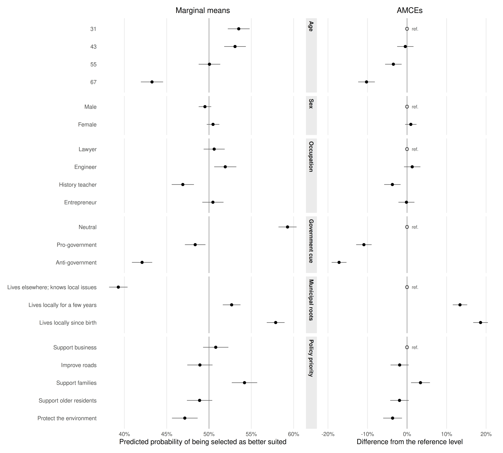
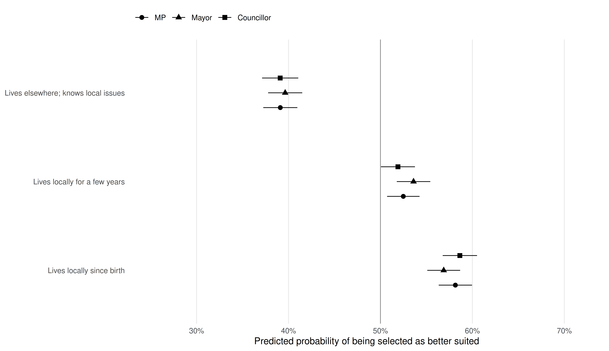
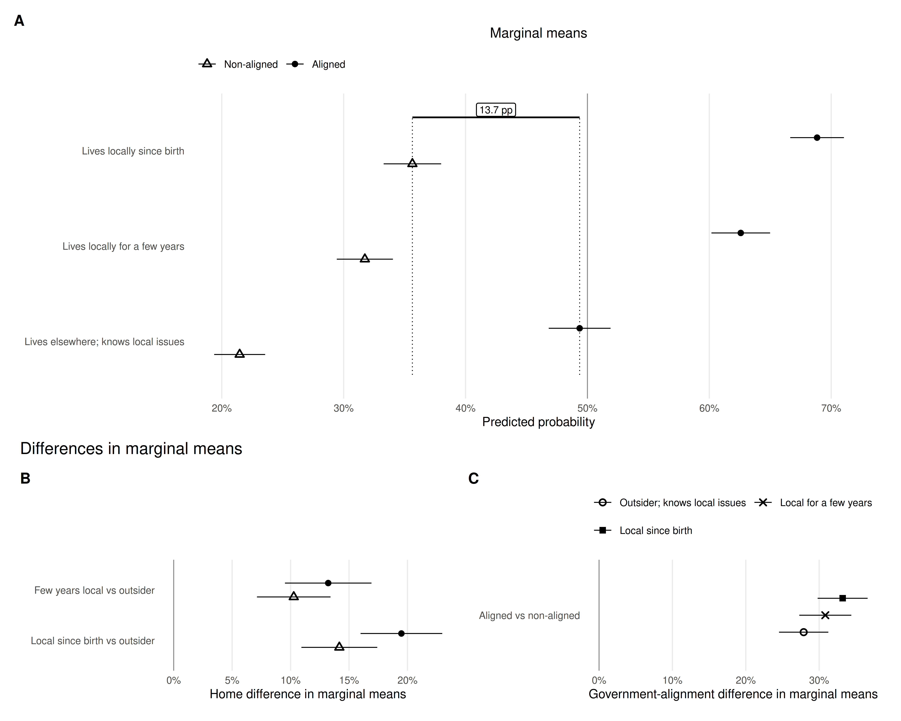

# Introduction

Territorial and partisan cues can coexist in candidate evaluation. Friends-and-neighbors voting (FNV) describes disproportionate support for candidates where they live, were born, or otherwise have a local connection [@key1949; @lewisbeck1983; @rice1987; @gimpel2008]. Local advantages appear in US state-legislative contests [@huntrouse2023], parliamentary elections [@arzheimer2012; @gorecki2012; @evans2017; @hunt2022], intraparty competition [@put2020], and Polish and German local elections [@czapiewski2021; @gorecki2022; @zissel2026]. Observational estimates combine information, canvassing, personal networks, name recognition, and mobilization. Field experiments show that appeals to candidates' local roots can increase turnout [@panagopoulos2017; @panagopoulosbailey2020], but not how territorial cues compare or interact with political alignment.

Candidate conjoint experiments can isolate several signals within a common choice environment [@hainmueller2014; @schwarz2022]. We contribute three comparisons in one study. First, we compare three degrees of municipal connection rather than a binary local--non-local treatment. Second, we hold the set of randomized profile attributes constant across MP, mayoral, and councillor prompts. Third, we examine whether the local-roots bonus varies with respondent--candidate political alignment in a polarized setting.

Poland combines a durable, affectively polarized government--opposition divide [@tworzecki2019] with electoral institutions that leave room for candidate-level and territorial cues. Open-list elections encourage personal-vote competition [@shugart2005], while independent lists and mayors remain prominent in municipal politics [@gendzwill2012]. Municipal elections can also convey second-order signals from the parliamentary arena: national governing parties often lose support, although comparative evidence shows that this pattern is conditional [@gendzwillkjaer2023]. This combination makes Poland a useful setting for comparing local roots with political alignment.

We use a candidate conjoint embedded in the 2024 Polish Local Election Study (PLES) [@DVN_LKY4WZ_2025]. Respondents were randomly assigned to evaluate candidates for MP, municipal councillor, or mayor. Each condition used the same set of randomized attributes, including municipal connection and attitude toward the current national government.

Stronger municipal connection increases the probability of selection, and the gradient appears across all three offices. Local roots and political alignment both matter. Among clearly positioned cases, profiles whose government stance matches the respondent's gain 27.9--33.2 percentage points over mismatched profiles. An aligned outsider even outperforms a non-aligned lifelong resident by 13.7 points. The primary model suggests a larger lifelong-residence bonus among aligned pairs, but this interaction varies across weights and alternative definitions of political alignment. We therefore treat the interaction as exploratory: local roots increase support in both groups, but they do not offset political mismatch.

# Local Roots Within the National Political Divide

## Graded municipal embeddedness

Survey and ballot-information experiments show that residence affects candidate evaluations when profiles provide comparable information [@campbellcowley2014; @harfst2023]. Other studies link the local-candidate advantage to expected local service [@campbell2019], place identity [@schultecloos2023], and community embeddedness [@ornstein2025], while finding that residence preferences are not reducible to one mechanism [@nyholt2024]. These findings make both behavioral localism---expectations about representation or service---and symbolic localism---attachment to a candidate perceived as part of the community---plausible.

Most experiments nevertheless compare one local category with one non-local category. Local political experience and birthplace can have different electoral implications [@tavits2010], and residence duration may convey different degrees or kinds of proximity. Parties also field recognizable parachute candidates with no prior constituency connection [@arterpoyet2024]. The first extension therefore treats municipal connection as graded rather than binary.

## Whether local roots are office-bound

Studies identify local-root advantages for party leaders [@put2021], national legislators [@hunt2022; @huntrouse2023], councillors [@czapiewski2021], and mayors [@gorecki2022; @zissel2026]. Electoral-system research also treats local ties as personal vote-earning attributes whose value depends on how voters choose among candidates [@shugart2005; @jankowski2016]. These studies examine different candidate pools and electoral settings. The second extension holds the profile information constant while changing only the office under consideration.

## Local roots and political alignment

Candidate roots can remain relevant alongside party labels under polarization and nationalization [@munis2021; @huntfontana2025]. At the same time, the second-order election model expects voters to punish national governing parties in lower-level contests, although municipal-election evidence shows that this pattern depends on party size and context [@gendzwillkjaer2023]. Existing local-roots studies rarely test whether the local bonus changes with respondent--candidate political alignment or whether local roots offset political mismatch. The third extension examines these questions together.

# Research Design

## Survey and sample

The conjoint was fielded online in wave 1 of PLES from 28 March to 7 April 2024 [@DVN_LKY4WZ_2025]. The quota sample contains 2,207 adults. Fieldwork, exclusions, quotas, and weights are documented in the [sampling appendix](#sec-sampling). At the time of fieldwork, the governing coalition led by Donald Tusk and the opposition centered on Law and Justice formed the principal two-block divide represented by the government-attitude cue.

Respondents were randomly assigned to an MP ($n=778$), councillor ($n=687$), or mayor ($n=742$) prompt and completed four paired-profile tasks. The attributes, levels, and outcomes were identical across conditions; only the office changed. The design produced 8,828 choices and 17,656 evaluated profiles. The five observed quota covariates were balanced across office conditions (all omnibus $p>.29$; Cramer's $V\le .085$).

## Attributes and outcomes

@tbl-attributes translates the attributes and levels recorded in the technical report. Sex and occupation appeared in gender-consistent Polish forms. The municipal-connection levels were complete statements. Below, we shorten the third level---residence elsewhere with declared local knowledge---to “outsider.” This statement resembles a common defense of parachute candidacy: it asserts local connection despite non-residence. Because it bundles non-residence with declared knowledge, the estimates compare complete statements rather than residence alone. The government item described a supporter, neutral candidate, or opponent of the current government. Rather than party labels, which are less comparable across a multiparty parliamentary arena and local contests, the task used a common government--opposition cue. The item explicitly named Donald Tusk's government and the governing coalition parties. The resulting estimate therefore applies to this high-salience statement, not to a generic party label.

| Attribute | Levels |
|---|---|
| Candidate sex | Woman; man |
| Occupation | Lawyer; engineer; history teacher; entrepreneur |
| Age | 31; 43; 55; 67 |
| Attitude toward current government | Supporter; neutral; opponent |
| Connection with municipality | Lives in the municipality since birth; lives in the municipality for a few years; lives in another municipality but declares knowledge of the area's problems |
| Important issue | More support for families; more support for older residents; more support for entrepreneurs; more concern for the environment and climate; more concern for road quality |

: Candidate attributes and randomized levels {#tbl-attributes}

*Note.* Translated from the Polish technical report. The same profile attributes were used in all office conditions. Age and sex were presented jointly with gendered occupational labels.

Respondents first selected the candidate better suited for the assigned office; this forced choice, common in candidate conjoint experiments, is the primary outcome [@hainmueller2014]. They then rated the selected profile's advantage over the alternative from 0 (“minimal advantage”) to 10 (“huge advantage”). For robustness, the selected profile retains this value and the other profile receives its negative, yielding a signed $-10$ to $10$ scale; a zero rating assigns zero to both profiles. @tbl-outcomes gives concise Polish and English descriptions. Both outcomes measure stated comparative evaluation, not turnout or vote choice.

The analysis follows the three contributions in the same order. First, we compare the few-years-resident and lifelong-resident statements with the outsider statement. These are contrasts between complete profile descriptions, not estimates of residence isolated from all wording.

Second, we compare the municipal-root contrasts across the MP, mayoral, and councillor prompts. The split-ballot assignment changes the office while holding the set of randomized attributes constant. We assess the full interaction, its omnibus Wald test, and nine pairwise office comparisons. We do not impose a rank ordering and treat cross-office heterogeneity as exploratory.

Third, political alignment was coded by combining the candidate's government stance with the respondent's 0--10 government rating. A profile is aligned when candidate and respondent are both pro-government or both anti-government; it is non-aligned when their positions differ. The primary coding defines scores 0--3 as anti-government and 7--10 as pro-government. Neutral candidate profiles and respondents scoring 4--6 remain in the pooled analysis but are excluded from the alignment comparison. We compare local-root contrasts within both groups and their difference-in-differences. Because this interaction depends on a constructed subgroup definition, we treat it as exploratory and report alternative cutoff points.

## Estimands and model specification

The main estimates come from unweighted linear probability models with heteroskedasticity-robust standard errors clustered by respondent. The models include indicators for every randomized attribute level and the office condition. Random assignment identifies average marginal component effects (AMCEs) relative to the stated reference levels [@hainmueller2014]. Because profile distributions can affect both interpretation and external validity, the estimates apply to the randomized distribution used here rather than to every possible real-world candidate pool [@delacuesta2022].

@fig-main-effects reports marginal means (MMs) and AMCEs. An MM is the average predicted probability of selection at an attribute level, averaging over the randomized distribution of the other attributes. An AMCE is the average change from a named reference level. Because the office and alignment analyses compare subgroups, we use MMs and response-scale differences in MMs, as recommended by @leeper2020. Difference-in-differences test whether the place-based bonus changes with political alignment [@egami2019].

To compare the relative importance of the six candidate attributes, we supplement the pooled model with a respondent-fixed-effects dominance analysis [@budescu1993; @azenbudescu2003]. Office is constant within respondent and is therefore absorbed by the fixed effects. We within-demean the outcome and all attribute-level indicators, keep the levels of each attribute grouped, and calculate each attribute's general dominance weight: its average incremental contribution to within-model R-squared across all predictor subsets. We normalize the six weights to sum to one. A custom nonparametric bootstrap resamples respondents with replacement while retaining all profiles within each sampled respondent. We report percentile 95% confidence intervals from 4,999 bootstrap replicates. For the municipal-roots minus government-cue contrast, the two-sided p-value compares the absolute centered-bootstrap deviation with the absolute observed difference and uses a plus-one correction.

The primary alignment subset contains 1,635 respondents and 8,712 profiles. The model includes an indicator for whether the respondent is pro- or anti-government, allowing baseline selection probabilities to differ between the two respondent groups. The appendices report the equations, alternative cutoff points defining political alignment, interaction tests, post-stratification weights, and the advantage-scale outcome.

# Results

## Average candidate evaluations

@fig-main-effects presents pooled MMs and AMCEs. The vertical reference line in the MM panel is 0.50, the average implied by paired forced choice. In the AMCE panel it is zero; open reference markers identify the omitted levels and should not be read as estimated zero effects.

Municipal residence produces sizable pooled contrasts. Relative to the outsider profile, residence for a few years increases the probability of selection by 13.4 percentage points (95% CI: 11.6 to 15.2), and lifelong residence increases it by 18.6 points (95% CI: 16.7 to 20.4). The corresponding MMs are 39.3%, 52.7%, and 57.9%.

Neutrality has the highest pooled MM (59.3%). Relative to a neutral profile, a pro-government profile loses 10.9 points (95% CI: 9.0 to 12.9) and an anti-government profile loses 17.2 points (95% CI: 15.3 to 19.1). These pooled penalties combine respondents who agree, disagree, or occupy a middle position; @sec-main-finding isolates aligned and non-aligned pairs. Other attributes matter less. Candidates aged 67 lose 10.3 points relative to candidates aged 31, while the 1.0-point female--male difference is uncertain (95% CI: $-0.5$ to 2.4), consistent with the small average gender effects in candidate-choice experiments [@schwarz2022]. Occupation and policy-priority contrasts are mostly modest, with absolute estimates no larger than 3.7 points.

{#fig-main-effects width=100% fig-alt="Two-panel coefficient plot showing marginal means and average marginal component effects for all candidate attributes. Category and level labels appear once, beside the left panel."}

*Note.* Unweighted linear probability model with respondent-clustered robust standard errors and 95% confidence intervals. The outcome equals one when the profile was selected as better suited for office. The MM panel averages predictions over the randomized distribution of other attributes; its vertical line marks 0.50. AMCEs are contrasts against the open reference markers; their vertical line marks zero. Estimates are expressed as proportions.

Municipal roots have the largest point share in the respondent-fixed-effects dominance analysis, accounting for 44.7% of the within-model explained variance across the six grouped attributes (95% bootstrap CI: 37.7% to 50.8%). The government--opposition cue follows at 35.9% (29.3% to 42.1%), and candidate age at 12.3% (8.4% to 17.0%). The municipal-roots share exceeds the government-cue share by 8.8 percentage points, but this difference is uncertain (95% bootstrap CI: -3.0 to 20.6; two-sided centered-bootstrap p = .142).

{#fig-dominance width=80% fig-alt="Horizontal point-and-interval plot of six candidate attributes' shares of within-model explained variance. Municipal roots have the largest point share at 44.7%; a bracket comparing it with the 35.9% government-opposition share reports p equals .142."}

## Local roots are not confined to local offices

Office-specific MMs in @fig-office show the municipal-connection gradient in every condition. Relative to the outsider profile, residence for a few years increases the probability of selection by 13.4 points for MPs (95% CI: 10.3 to 16.5), 14.0 for mayors (95% CI: 10.8 to 17.1), and 12.8 for councillors (95% CI: 9.6 to 16.1). Lifelong residence increases it by 19.0 points for MPs (95% CI: 15.9 to 22.2), 17.2 for mayors (95% CI: 14.1 to 20.4), and 19.5 for councillors (95% CI: 16.2 to 22.9).

The point estimates do not follow a councillor--mayor--MP ordering. The omnibus interaction is not detected, $F(4,2185)=0.661$, $p=.619$. None of the nine pairwise office comparisons within the three municipal-connection levels is statistically distinguishable from zero (unadjusted $p=.141$ to $.946$; all Holm-adjusted $p=1.000$). These tests do not prove equality, but they provide no evidence that the local-roots bonus differs across the three prompts.

{#fig-office width=100% fig-alt="Point estimates and confidence intervals for the three municipal-roots levels, shown separately for MP, mayor, and councillor profiles."}

*Note.* MMs from an unweighted linear probability model interacting municipal roots with office; 95% robust, respondent-clustered confidence intervals. The vertical line marks 0.50. Numerical comparisons in the text are differences in MMs within office.

## Local roots and political alignment {#sec-main-finding}

@fig-heterogeneity compares local-root and political-alignment contrasts among clearly pro- and anti-government profiles and respondents. The top panel displays marginal means across municipal-connection levels for aligned and non-aligned pairs. The lower-left panel shows resident--outsider differences within each alignment group; the lower-right panel shows aligned--non-aligned differences within each municipal-connection level.

Local roots increase the probability of selection in both alignment groups. Relative to the outsider profile, residence for a few years increases selection probability by 10.3 points among non-aligned pairs (95% CI: 7.1 to 13.4) and 13.2 points among aligned pairs (95% CI: 9.5 to 16.9). Lifelong residence increases it by 14.2 points among non-aligned pairs (95% CI: 10.9 to 17.4) and 19.5 points among aligned pairs (95% CI: 16.0 to 23.0). The difference-in-differences is 2.9 points for residence of a few years (95% CI: $-1.9$ to 7.8, $p=.230$) and 5.3 points for lifelong residence (95% CI: 0.7 to 9.9, $p=.024$; Holm-adjusted $p=.047$). Only the lifelong-residence interaction is detected in the primary specification.

Political-alignment contrasts are larger in magnitude. Aligned profiles gain 27.9 points among outsiders (95% CI: 24.5 to 31.3), 30.8 among residents of a few years (95% CI: 27.3 to 34.4), and 33.2 among lifelong residents (95% CI: 29.8 to 36.6). @fig-heterogeneity highlights one additional cross-profile contrast from the same model. An aligned outsider has an MM of 49.4%, compared with 35.6% for a non-aligned lifelong resident: a 13.7-point difference (95% CI: 10.0 to 17.5). This gap indicates that strong local roots do not offset political misalignment in this design.

The interaction evidence remains exploratory. The lifelong-residence interaction is about 4.9--5.1 points under both weighting schemes but does not retain Holm-adjusted significance; it is 3.5--4.8 points under alternative cutoff points defining political alignment. The signed-advantage outcome supports a larger lifelong-residence bonus among aligned pairs (0.90 scale points, 95% CI: 0.26 to 1.53; Holm-adjusted $p=.012$). The stable findings are positive local-root contrasts in both groups and larger political-alignment contrasts; stronger local benefits among aligned pairs require replication. Candidate profiles contain no party label, so these estimates concern congruence on the government--opposition cue, not a generic party effect.

{#fig-heterogeneity width=100% fig-alt="Three-panel black-and-white plot. The top panel compares municipal-connection marginal means for aligned and non-aligned pairs. The lower-left panel shows resident-minus-outsider differences within alignment groups. The lower-right panel shows aligned-minus-non-aligned differences within municipal-connection levels. In the top panel, thin dotted vertical guides through two reference points are joined by a horizontal line labelled 13.7 percentage points."}

*Note.* MMs and differences in MMs from an unweighted linear probability model with municipal-roots-by-alignment interactions, an indicator for pro- versus anti-government respondent attitudes, and robust, respondent-clustered 95% confidence intervals ($1{,}635$ respondents; $8{,}712$ profiles). Aligned means pro/pro or anti/anti candidate--respondent combinations. Non-aligned means pro/anti or anti/pro combinations. Neutral candidate profiles and respondents scoring 4--6 are outside this comparison. The MM panel uses a 0.50 reference line; difference panels use zero. Open triangles and filled circles distinguish non-aligned and aligned pairs; open circles, crosses, and filled squares distinguish outsider, few-years-resident, and lifelong-resident statements. The bracket highlights the additional 13.7-point cross-profile contrast described in the text. All seven within-dimension pairwise differences displayed in the lower panels are significant at $\alpha=.05$: both resident--outsider contrasts within aligned and non-aligned pairs, and aligned--non-aligned contrasts at all three municipal-root levels (@tbl-figure3-pairwise).

# Discussion

The findings follow the three comparisons. Respondents distinguish graded municipal connections; the gradient appears in all three office prompts; and local roots increase support among both aligned and non-aligned pairs. Political mismatch nevertheless produces larger probability differences, while the local-roots-by-alignment interaction remains exploratory.

Residence for a few years raises the probability of selection by 13.4 points relative to the outsider profile, and lifelong residence raises it by 18.6 points. These experimental contrasts are compatible with Polish electoral-return evidence of local vote and turnout advantages [@gorecki2022], while separating the presented profile statements from campaign contact, information diffusion, and mobilization. Municipal roots also have the largest point share in the pooled dominance analysis, although their 8.8-point lead over the government cue is uncertain.

The same gradient appears for MP, mayoral, and councillor profiles. The omnibus and pairwise tests detect no office differences, but the intervals do not establish equal effects. Respondents may use municipal connection as a general candidate-quality cue rather than recalibrating it to each office. Replication with treatments tailored to the territorial scale of each office would distinguish a general heuristic from office-specific evaluations.

Political alignment changes the probability of selection by 28--33 points. An aligned outsider is 13.7 points more likely to be selected than a non-aligned lifelong resident. Strong local roots therefore do not offset political mismatch. US experimental evidence likewise finds that local-root rewards can cross party lines [@huntfontana2025], but the present study directly compares local roots with respondent-specific political alignment. The larger alignment contrasts and the pooled dominance ranking answer different questions: the former compare conditional MMs, whereas the latter summarizes each randomized attribute's contribution across the full sample.

Local-root contrasts remain positive among both aligned and non-aligned pairs. The 5.3-point primary interaction changes under alternative alignment cutoffs and does not retain adjusted significance under either weighting scheme. The stable result is coexistence; whether aligned candidates receive a larger local-roots bonus remains an exploratory finding that requires replication.

The design makes three trade-offs. First, randomized profile information provides control over candidate cues at the cost of behavioral realism: the outcome is stated suitability for office, not an actual vote [@hainmueller2015]. Second, the online quota sample made the large split-ballot experiment feasible but is not a probability sample; similar weighted estimates cannot eliminate selection concerns. Third, holding a profile distribution fixed permits clear contrasts, but the estimates may change with the prevalence or combination of candidate traits [@delacuesta2022]. The outsider statement adds a realistic defense of parachute candidacy---declared local knowledge---but therefore does not isolate residence alone. The experiment also cannot identify psychological mediators, canvassing, home-area mobilization, acquaintance, or network effects [@campbell2019; @harfst2023; @velimsky2024; @schultecloos2023; @nyholt2024; @ornstein2025]. Within these limits, randomization identifies contrasts among the complete statements presented to this sample.

# Conclusion

Polish respondents distinguish graded municipal connections: residence for a few years raises the probability of selection by 13.4 points relative to the outsider profile, and lifelong residence raises it by 18.6 points. The gradient appears in all three office prompts without detected office differences. Local roots also increase support among both aligned and non-aligned pairs. Political alignment, however, changes selection by 27.9--33.2 points, and an aligned outsider outperforms a non-aligned lifelong resident. The interaction between these cues remains exploratory. Local roots therefore matter across offices and political alignments, but they do not offset political mismatch.

# Data availability {.unnumbered}

The accompanying `reproduction/` directory contains the redistributable source datasets, R analysis code, `targets` workflow, and generated numerical results. Its pipeline regenerates the figures used by this Quarto manuscript.

# Funding {.unnumbered}

The survey was conducted as part of the project “Political Representation of Women in Local Governments,” funded by the National Science Centre, Poland (grant 2021/43/B/HS5/01059).

# Appendix {.unnumbered}

## Sampling, fieldwork, and weights {.unnumbered #sec-sampling}

Wave 1 was fielded online between 28 March and 7 April 2024. Ariadna invited 9,534 panel members; 2,935 entered the survey, 521 did not complete it, and 207 were removed by quality-control criteria, leaving 2,207 respondents. Quotas covered sex, five age categories, five municipality-size categories, two education categories, and 16 voivodeships. The split-ballot assignment yielded 778 MP, 742 mayor, and 687 councillor respondents.

The released data contain two post-stratification weights. The census-margin post-stratification weight adjusts the quota dimensions to 2021 census margins and ranges from 0.536 to 1.760 in wave 1. The census and reported 2023-vote post-stratification weight additionally adjusts reported turnout and party vote in the 2023 parliamentary election and ranges from 0.229 to 3.004. The unweighted model is primary because the experimental attributes are randomized. @tbl-robustness shows that both weighted specifications yield the same substantive municipal-roots and government-cue pattern.

## Split-ballot and profile randomization {.unnumbered #sec-balance}

The split-ballot groups are balanced on sex, age group, education, municipality size, and voivodeship. Omnibus chi-square tests yield $p=.291$ to $.941$ (all Holm-adjusted $p=1.000$), and Cramer's $V$ ranges from .007 to .085.

@tbl-balance reports randomized attribute-level shares within each office condition. The maximum minus minimum office share is at most .019 across all levels, consistent with the common randomization scheme.

| Attribute | Level | MP | Mayor | Councillor | Max-min |
|:---|:---|---:|---:|---:|---:|
| Candidate age | 31 | 0.248 | 0.247 | 0.251 | 0.004 |
| Candidate age | 43 | 0.259 | 0.257 | 0.248 | 0.011 |
| Candidate age | 55 | 0.244 | 0.256 | 0.246 | 0.012 |
| Candidate age | 67 | 0.249 | 0.241 | 0.255 | 0.015 |
| Candidate sex | Male | 0.494 | 0.511 | 0.492 | 0.019 |
| Candidate sex | Female | 0.506 | 0.489 | 0.508 | 0.019 |
| Occupation | Lawyer | 0.258 | 0.252 | 0.252 | 0.006 |
| Occupation | Engineer | 0.252 | 0.241 | 0.252 | 0.011 |
| Occupation | History teacher | 0.246 | 0.244 | 0.237 | 0.009 |
| Occupation | Entrepreneur | 0.245 | 0.264 | 0.259 | 0.019 |
| Government-opposition cue | Neutral | 0.334 | 0.342 | 0.334 | 0.008 |
| Government-opposition cue | Pro-government | 0.341 | 0.333 | 0.340 | 0.008 |
| Government-opposition cue | Anti-government | 0.325 | 0.325 | 0.326 | 0.001 |
| Municipal roots | Lives elsewhere; knows local issues | 0.328 | 0.337 | 0.328 | 0.009 |
| Municipal roots | Lives locally for a few years | 0.335 | 0.328 | 0.331 | 0.007 |
| Municipal roots | Lives locally since birth | 0.337 | 0.335 | 0.341 | 0.006 |
| Policy priority | Support business | 0.195 | 0.201 | 0.205 | 0.009 |
| Policy priority | Improve roads | 0.197 | 0.199 | 0.201 | 0.004 |
| Policy priority | Support families | 0.210 | 0.203 | 0.194 | 0.016 |
| Policy priority | Support older residents | 0.199 | 0.196 | 0.199 | 0.003 |
| Policy priority | Protect the environment | 0.200 | 0.201 | 0.202 | 0.003 |

: Randomized attribute-level shares by office condition {#tbl-balance}

## Task wording and coding {.unnumbered #sec-wording}

Respondents selected the profile better suited for the assigned office and then rated its advantage over the alternative. @tbl-task-wording reports the Polish questionnaire wording and a direct English translation. The respondent moderator asks: “What is your attitude toward the government of Donald Tusk and the coalition currently governing Poland?” Its scale runs from 0 (opponent) to 10 (supporter).

| Item | Polish wording | English translation |
|:---|:---|:---|
| Introduction | Za chwilę zobaczysz na ekranie kilka par [kandydatów na posłów / kandydatów na radnych gminy (miasta) / kandydatów na wójta (burmistrza)]. | In a moment, you will see several pairs of [candidates for members of parliament / candidates for municipal (city) councillors / candidates for commune head (mayor)]. |
| Pair-review instruction | Obejrzyj dokładnie każdą parę i wskaż, która z dwóch osób według Ciebie lepiej nadaje się na [posła lub posłankę / radnego lub radną / wójta (burmistrza)]. | Examine each pair carefully and indicate which of the two people, in your opinion, is better suited to be [a member of parliament / a municipal councillor / a commune head (mayor)]. |
| Forced-choice instruction | Nawet jeśli nie jesteś do końca przekonany/-a lub nie podobają Ci się obie przedstawione opcje, wskaż tę, która jest choć trochę lepsza niż druga. | Even if you are not entirely certain or dislike both options presented, indicate the one that is at least slightly better than the other. |
| Occupation (8) | Zawód (8): inżynier / inżynierka / prawnik / prawniczka / nauczyciel historii / nauczycielka historii / właściciel małej firmy / właścicielka małej firmy | Occupation (8): engineer (male/female wording) / lawyer (male/female wording) / history teacher (male/female wording) / small-business owner (male/female wording) |
| Age (4) | Wiek (4): 31 lat / 43 lata / 55 lat / 67 lat | Age (4): 31 / 43 / 55 / 67 years |
| Attitude toward the current government (3) | Stosunek do obecnego rządu (3): wspiera rząd D. Tuska i partie koalicji rządzącej / jest w opozycji do rządu D. Tuska i partii koalicji rządzącej / zajmuje neutralne stanowisko wobec rządu D. Tuska i partii koalicji rządzącej | Attitude toward the current government (3): supports Donald Tusk's government and the governing coalition parties / is in opposition to Donald Tusk's government and the governing coalition parties / takes a neutral position toward Donald Tusk's government and the governing coalition parties |
| Residence (3) | Zamieszkanie (3): mieszka w mieście/gminie od urodzenia / mieszka w mieście/gminie od kilku lat / mieszka w innym mieście/gminie, ale deklaruje że zna problemy tej okolicy | Residence (3): has lived in the town/municipality since birth / has lived in the town/municipality for a few years / lives in another town/municipality but states that they know the problems of the local area |
| Important policy proposal (5) | Ważny postulat (5): więcej wsparcia dla rodzin / więcej wsparcia dla seniorów / więcej wsparcia dla przedsiębiorców / więcej troski o środowisko i klimat / więcej troski o jakość dróg | Important policy proposal (5): more support for families / more support for older residents / more support for entrepreneurs / more attention to the environment and climate / more attention to road quality |
| Q48 `conjoint competence` | Która osoba nadaje się lepiej na ten urząd? | Which person is better suited to this office? |
| Q48 response format | [binarny] | [binary] |
| Q49 `conjointvote` | Oceń w skali od 0 do 10 jak duża jest przewaga wybranej przez Ciebie osoby nad tą drugą? | On a scale from 0 to 10, rate how large the advantage of the person you selected is over the other person. |
| Q49 response scale | [skala od 0 – minimalna przewaga do 10 – ogromna przewaga, bez trudno powiedzieć] | [scale from 0—minimal advantage—to 10—enormous advantage; no “difficult to say” option] |

: Questionnaire wording and English translation {#tbl-task-wording tbl-colwidths="[18,41,41]"}

| Measure | Analysis coding |
|:---|:---|
| Forced choice (Q48) | Selected profile = 1; other profile = 0 |
| Advantage (Q49) | Selected profile = 0 to 10; other profile = 0 to -10 |

: Outcome coding {#tbl-outcomes}

The advantage ratings indicate clear choices in most tasks: 83.1% are at or above the scale midpoint and 48.6% fall between 7 and 10.

| Advantage rating | Number of tasks | Percent |
|---:|---:|---:|
| 0 | 201 | 2.3 |
| 1 | 222 | 2.5 |
| 2 | 316 | 3.6 |
| 3 | 357 | 4.0 |
| 4 | 400 | 4.5 |
| 5 | 1503 | 17.0 |
| 6 | 1542 | 17.5 |
| 7 | 1750 | 19.8 |
| 8 | 1314 | 14.9 |
| 9 | 571 | 6.5 |
| 10 | 652 | 7.4 |

: Distribution of the selected profile's advantage rating {#tbl-advantage-distribution}

The alignment coding is:

- aligned: pro-government candidate with a respondent scoring 7--10, or anti-government candidate with a respondent scoring 0--3;
- non-aligned: pro-government candidate with a respondent scoring 0--3, or anti-government candidate with a respondent scoring 7--10.

Neutral candidate profiles and respondents scoring 4--6 are excluded from the primary alignment comparison. Alternative respondent cutoffs are reported in the [alignment-sensitivity appendix](#sec-alignment-sensitivity).

## Model specifications {.unnumbered #sec-models}

For profile $j$ in task $t$ evaluated by respondent $i$, the pooled model underlying @fig-main-effects is

$$
Y_{ijt}=\alpha+\sum_{a}\sum_{l\neq 0}\beta_{al}D_{ijtal}+\boldsymbol{\delta}^{\mathsf T}\mathbf{O}_{i}+\varepsilon_{ijt},
$$

where $D_{ijtal}$ indexes non-reference level $l$ of randomized attribute $a$, and $\mathbf{O}_{i}$ contains office-condition indicators. All confidence intervals and tests use heteroskedasticity-robust standard errors clustered by respondent. @fig-office replaces the additive municipal-roots and office terms with their full interaction:

$$
Y_{ijt}=\alpha+\boldsymbol{\beta}^{\mathsf T}\mathbf{X}_{ijt}+\boldsymbol{\gamma}^{\mathsf T}(\mathbf{M}_{ijt}\times\mathbf{O}_{i})+\varepsilon_{ijt}.
$$

@fig-heterogeneity analogously interacts municipal roots $\mathbf{M}_{ijt}$ with the binary alignment measure $\mathbf{A}_{ijt}$ and includes an indicator for the respondent's pro- or anti-government attitude group $\mathbf{R}_{i}$:

$$
Y_{ijt}=\alpha+\boldsymbol{\beta}^{\mathsf T}\mathbf{X}_{ijt}+\boldsymbol{\theta}^{\mathsf T}(\mathbf{M}_{ijt}\times\mathbf{A}_{ijt})+\boldsymbol{\rho}^{\mathsf T}\mathbf{R}_{i}+\boldsymbol{\delta}^{\mathsf T}\mathbf{O}_{i}+\varepsilon_{ijt}.
$$

In the second and third equations, $\mathbf{X}_{ijt}$ contains the remaining randomized attributes. In the alignment model, the randomized government cue enters through $\mathbf{A}_{ijt}$ rather than as a separate additive term. Reported conditional results are predictions averaged over the analyzed profile distribution and their linear contrasts, not the raw interaction coefficients.

## Pairwise contrasts displayed in Figure 3 {.unnumbered}

@tbl-figure3-pairwise reports the seven pairwise contrasts displayed in @fig-heterogeneity. Holm adjustment treats the seven displayed comparisons as one family.

| Panel comparison | Condition | Contrast | Difference (points) | 95% CI | Raw $p$ | Holm $p$ |
|:---|:---|:---|---:|:---|---:|---:|
| Municipal statement | Non-aligned | Few-years resident minus outsider with local knowledge | 10.3 | 7.1, 13.4 | $1.96 \times 10^{-10}$ | $1.96 \times 10^{-10}$ |
| Municipal statement | Non-aligned | Lifelong resident minus outsider with local knowledge | 14.2 | 10.9, 17.4 | $2.43 \times 10^{-17}$ | $7.28 \times 10^{-17}$ |
| Municipal statement | Aligned | Few-years resident minus outsider with local knowledge | 13.2 | 9.5, 16.9 | $3.58 \times 10^{-12}$ | $7.16 \times 10^{-12}$ |
| Municipal statement | Aligned | Lifelong resident minus outsider with local knowledge | 19.5 | 16.0, 23.0 | $6.61 \times 10^{-27}$ | $2.65 \times 10^{-26}$ |
| Political alignment | Outsider with local knowledge | Aligned minus non-aligned | 27.9 | 24.5, 31.3 | $2.80 \times 10^{-55}$ | $1.40 \times 10^{-54}$ |
| Political alignment | Few-years resident | Aligned minus non-aligned | 30.8 | 27.3, 34.4 | $3.55 \times 10^{-60}$ | $2.13 \times 10^{-59}$ |
| Political alignment | Lifelong resident | Aligned minus non-aligned | 33.2 | 29.8, 36.6 | $1.23 \times 10^{-73}$ | $8.59 \times 10^{-73}$ |

: Pairwise contrasts displayed in Figure 3 {#tbl-figure3-pairwise}

*Note.* Differences are percentage points from the unweighted alignment model, with heteroskedasticity-robust standard errors clustered by respondent. Confidence intervals are 95%. Raw and Holm-adjusted p-values come from the same seven model-based linear contrasts plotted in @fig-heterogeneity.

## Alignment-coding sensitivity {.unnumbered #sec-alignment-sensitivity}

The primary 0--3 and 7--10 endpoints are operational choices rather than natural breaks in the attitude scale. @tbl-alignment-sensitivity repeats the aligned--non-aligned contrasts using narrower (0--2 versus 8--10) and broader (0--4 versus 6--10) definitions of political alignment. The estimates remain positive at every municipal-connection level and retain the same ordering relative to the residence contrasts. Their exact magnitude declines as the respondent groups broaden.

| Coding | Municipal-roots level | Respondents | Profiles | Aligned minus non-aligned | 95% CI |
|:---|:---|---:|---:|---:|:---|
| Narrow: 0-2 vs 8-10 | Lives elsewhere; knows local issues | 1381 | 7366 | 0.300 | 0.263, 0.337 |
| Narrow: 0-2 vs 8-10 | Lives locally for a few years | 1381 | 7366 | 0.324 | 0.286, 0.363 |
| Narrow: 0-2 vs 8-10 | Lives locally since birth | 1381 | 7366 | 0.335 | 0.298, 0.372 |
| Primary: 0-3 vs 7-10 | Lives elsewhere; knows local issues | 1635 | 8712 | 0.279 | 0.245, 0.313 |
| Primary: 0-3 vs 7-10 | Lives locally for a few years | 1635 | 8712 | 0.308 | 0.273, 0.344 |
| Primary: 0-3 vs 7-10 | Lives locally since birth | 1635 | 8712 | 0.332 | 0.298, 0.366 |
| Broad: 0-4 vs 6-10 | Lives elsewhere; knows local issues | 1841 | 9776 | 0.259 | 0.227, 0.291 |
| Broad: 0-4 vs 6-10 | Lives locally for a few years | 1841 | 9776 | 0.299 | 0.265, 0.333 |
| Broad: 0-4 vs 6-10 | Lives locally since birth | 1841 | 9776 | 0.307 | 0.274, 0.340 |

: Sensitivity of aligned--non-aligned contrasts to alternative definitions of political alignment {#tbl-alignment-sensitivity}

*Note.* Entries are differences in marginal means from the alignment model, with robust, respondent-clustered 95% confidence intervals. Respondents between the indicated endpoint groups and neutral candidate profiles are excluded. The respondent and profile counts are constant across the three municipal-connection rows within each coding.

### Interaction robustness {.unnumbered}

@tbl-interaction-robustness reports whether the local bonus differs between aligned and non-aligned pairs. Holm adjustment covers the two municipal contrasts within each specification.

| Coding/outcome | Weight | Municipal contrast | Difference-in-differences | 95% CI | Holm $p$ |
|:---|:---|:---|---:|:---|---:|
| Narrow forced choice | None | Few years local | .024 | -.028, .077 | .363 |
| Narrow forced choice | None | Local since birth | .035 | -.015, .085 | .334 |
| Primary forced choice | None | Few years local | .029 | -.019, .078 | .230 |
| Primary forced choice | None | Local since birth | .053 | .007, .099 | .047 |
| Primary forced choice | Census margins | Few years local | .024 | -.025, .074 | .337 |
| Primary forced choice | Census margins | Local since birth | .051 | .004, .098 | .066 |
| Primary forced choice | Census + 2023 vote | Few years local | .030 | -.025, .084 | .286 |
| Primary forced choice | Census + 2023 vote | Local since birth | .049 | -.002, .100 | .116 |
| Primary signed advantage | None | Few years local | .245 | -.410, .899 | .463 |
| Primary signed advantage | None | Local since birth | .896 | .259, 1.534 | .012 |
| Broad forced choice | None | Few years local | .040 | -.006, .085 | .089 |
| Broad forced choice | None | Local since birth | .048 | .004, .092 | .069 |

: Robustness of municipal-connection-by-alignment interactions {#tbl-interaction-robustness}

*Note.* Forced-choice estimates are probability differences; signed-advantage estimates are points on the $-10$ to $10$ scale. Positive values indicate a larger local bonus among aligned pairs.

## Tabular model estimates {.unnumbered #sec-estimates}

@tbl-model-estimates reports the coefficients from the unweighted pooled linear probability model used for the AMCE panel in @fig-main-effects. Office coefficients are close to zero by construction because exactly one profile is selected in each pair and office is assigned at respondent level; the office-specific quantities of interest in @fig-office come from interactions with municipal roots.

| Term | Estimate | Std. error | 95% CI |
|:---|---:|---:|:---|
| Intercept | 0.539 | 0.015 | 0.510, 0.568 |
| Age: 43 vs 31 | -0.004 | 0.011 | -0.025, 0.016 |
| Age: 55 vs 31 | -0.035 | 0.011 | -0.055, -0.014 |
| Age: 67 vs 31 | -0.103 | 0.011 | -0.124, -0.081 |
| Female vs male | 0.010 | 0.007 | -0.005, 0.024 |
| Engineer vs lawyer | 0.013 | 0.011 | -0.008, 0.034 |
| History teacher vs lawyer | -0.037 | 0.011 | -0.058, -0.016 |
| Entrepreneur vs lawyer | -0.002 | 0.010 | -0.022, 0.019 |
| Pro-government vs neutral | -0.109 | 0.010 | -0.129, -0.090 |
| Anti-government vs neutral | -0.172 | 0.010 | -0.191, -0.153 |
| Few years local vs outsider | 0.134 | 0.009 | 0.116, 0.152 |
| Local since birth vs outsider | 0.186 | 0.009 | 0.167, 0.204 |
| Improve roads vs support business | -0.019 | 0.012 | -0.042, 0.004 |
| Support families vs support business | 0.034 | 0.012 | 0.010, 0.058 |
| Support older residents vs support business | -0.019 | 0.012 | -0.043, 0.004 |
| Environment vs support business | -0.037 | 0.012 | -0.060, -0.013 |
| Mayor vs MP prompt | 0.000 | 0.002 | -0.004, 0.005 |
| Councillor vs MP prompt | 0.001 | 0.002 | -0.003, 0.005 |

: Pooled unweighted linear probability model {#tbl-model-estimates}

## Weighting and alternative-outcome robustness {.unnumbered #sec-robustness}

@tbl-robustness compares the four focal AMCEs across the unweighted model, the census-margin post-stratified model, and the census plus reported 2023-vote post-stratified model. It also reports the unweighted signed-advantage model. Weighting changes some pooled government coefficients because those cues interact with respondent orientations, but it does not change the direction or substantive conclusion. Municipal-roots estimates remain positive under every specification.

For the alternative outcome, respondents rated the selected profile's advantage from 0 to 10. Across the 8,828 tasks, all scale points occur in the data. The selected profile retains the non-negative value and the unselected profile receives its negative, producing a symmetric profile-level scale from $-10$ to $10$. On this scale, living locally for a few years increases the advantage by 1.79 points and lifelong residence by 2.48 points; pro-government and anti-government cues reduce it by 1.43 and 2.28 points, respectively, relative to neutrality.

| Outcome | Weight | Attribute | Contrast | Estimate | 95% CI |
|:---|:---|:---|:---|---:|:---|
| Signed advantage | None | Government-opposition cue | Anti-government vs neutral | -2.279 | -2.538, -2.020 |
| Signed advantage | None | Government-opposition cue | Pro-government vs neutral | -1.431 | -1.699, -1.163 |
| Signed advantage | None | Municipal roots | Few years local vs outsider | 1.786 | 1.542, 2.030 |
| Signed advantage | None | Municipal roots | Local since birth vs outsider | 2.480 | 2.231, 2.729 |
| Forced choice | None | Government-opposition cue | Anti-government vs neutral | -0.172 | -0.191, -0.153 |
| Forced choice | None | Government-opposition cue | Pro-government vs neutral | -0.109 | -0.129, -0.090 |
| Forced choice | None | Municipal roots | Few years local vs outsider | 0.134 | 0.116, 0.152 |
| Forced choice | None | Municipal roots | Local since birth vs outsider | 0.186 | 0.167, 0.204 |
| Forced choice | Census-margin post-stratification | Government-opposition cue | Anti-government vs neutral | -0.173 | -0.193, -0.154 |
| Forced choice | Census-margin post-stratification | Government-opposition cue | Pro-government vs neutral | -0.114 | -0.134, -0.094 |
| Forced choice | Census-margin post-stratification | Municipal roots | Few years local vs outsider | 0.127 | 0.108, 0.146 |
| Forced choice | Census-margin post-stratification | Municipal roots | Local since birth vs outsider | 0.184 | 0.165, 0.203 |
| Forced choice | Census + reported 2023-vote post-stratification | Government-opposition cue | Anti-government vs neutral | -0.149 | -0.170, -0.129 |
| Forced choice | Census + reported 2023-vote post-stratification | Government-opposition cue | Pro-government vs neutral | -0.143 | -0.165, -0.121 |
| Forced choice | Census + reported 2023-vote post-stratification | Municipal roots | Few years local vs outsider | 0.118 | 0.098, 0.139 |
| Forced choice | Census + reported 2023-vote post-stratification | Municipal roots | Local since birth vs outsider | 0.178 | 0.158, 0.199 |

: Robustness of focal cue estimates {#tbl-robustness}

*Note.* Forced-choice coefficients are probability differences; advantage coefficients are points on the signed $-10$ to $10$ profile scale. All models use robust, respondent-clustered standard errors and include all randomized profile attributes plus office indicators.

# References {.unnumbered}
